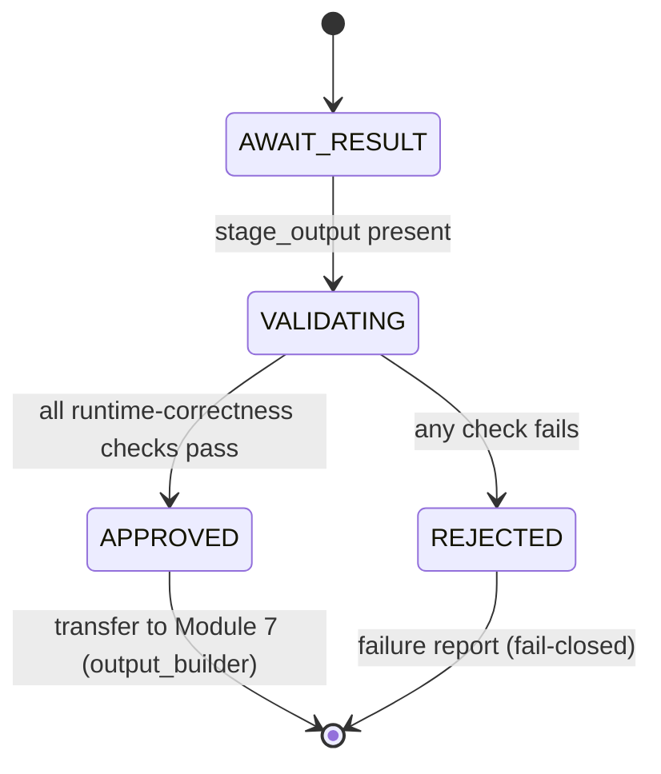

# Module 6 - Quality Gate (v1.0)

> **Status:** Specification finalized and validated against the completed Runtime
> Configuration System. Design + finalize step; no redesign of locked components.
> **Registry note:** `module_registry.yaml` (LOCKED v1.0) records this module as
> `runtime.module.quality_gate`, `status: planned`. This finalization does **not**
> modify the locked registry; advancing the `status` field is a future coordinated
> registry version bump governed by the locked upgrade policy.
> **Position in chain:** Order 6. Entry module of `mode.validation`. Runs after Module 5;
> transfers control to Module 7 (Output Builder).

## Purpose

Validate the **Runtime correctness** of the execution produced by Module 5 and decide
whether execution may proceed to Module 7. Module 6 checks contracts, interfaces,
configuration compatibility, and runtime constraints. It verifies that the runtime behaved
correctly - **not** whether the content is creatively good.

Module 6 is **not** the Master Runtime. It judges runtime correctness; it does not review
business quality, and it never modifies outputs.

## Conformance to Master Runtime Architecture v1.1

Module 6 is the entry module of `mode.validation` (`validation_policy.active: true`). It
consumes the `stage_output` from Module 5 and produces a validated output plus a quality
(validation) report. Per the fail-closed philosophy, it either approves forward transition
or terminates; it performs no generation and rewrites nothing.

### Output mapping to the locked Module Registry (no redesign)

The registry fixes Module 6 outputs as `validated_output` and `quality_report`. This
specification's deliverables map onto them exactly:

| Design-level artifact | Locked registry output it populates |
|---|---|
| Validation Result + Approval Status | `validated_output` (the input result, marked approved/failed - unmodified) |
| Validation Report | `quality_report` |
| Validation Metadata | carried within `quality_report` provenance |

> `validated_output` is the **same** `stage_output` passed through unchanged, annotated with
> an approval verdict. Module 6 never edits the artifact.

## Responsibilities (one responsibility)

**Single responsibility:** *Validate runtime correctness of the Execution Result and produce
the Validation Result + Report.*

Validations performed:
- **Execution Result** - present, well-formed, status `completed`.
- **Execution Metadata** - present and consistent with the Execution Plan.
- **Runtime Contracts** - the stage output conforms to its declared contract shape.
- **Runtime Configuration compatibility** - config passes the Runtime Versions gate.
- **Required Runtime constraints** - runtime constraints (from the plan/state) are satisfied.
- **Module interface compliance** - inputs/outputs conform to the Module Registry contract.

Then: emit Validation Result, Validation Report, Validation Metadata, and an Approval
Status; transfer control to Module 7 (`runtime.module.output_builder`).

## Out of scope

- Generating ideas or any content.
- Reviewing **business/creative quality** (comedy strength, virality, narrative merit).
- Rewriting, editing, or otherwise modifying outputs.
- Executing Runtime workflows (Module 5).
- Modifying any Runtime Configuration.

## Dependencies

| Kind | Value (from LOCKED config) |
|---|---|
| Predecessor module | `runtime.module.execution_engine` |
| Successor module (`next`) | `runtime.module.output_builder` |
| Inputs | `stage_output` |
| Outputs | `validated_output`, `quality_report` |
| Config dependency | `config.repository_map` |
| Operating mode | `mode.validation` (entry module; `validation_policy.active: true`; `next_mode: mode.shutdown`) |

## Runtime Configuration usage

| Component | How Module 6 uses it |
|---|---|
| **Runtime Manifest** | Read (via context) for `execution_policies.validation` (strict) and fail-closed/logging. |
| **Repository Map** | Direct dependency: resolve contract references (by logical id) used to check output shape. No hardcoded paths. |
| **Module Registry** | Verify module interface compliance (declared inputs/outputs, `next`). |
| **Execution Modes** | Confirm operation in `mode.validation`; record `next_mode: mode.shutdown`. |
| **Runtime Versions** | Confirm the configuration set is compatible. |

## Validation (fail-closed)

Module 6 verifies:
1. **Module 5 completed** - `stage_output` present with status `completed`.
2. **Runtime contracts satisfied** - output conforms to its declared contract shape.
3. **Configuration compatible** - config passes the Runtime Versions gate.
4. **Execution artifacts valid** - Execution Result + Metadata are well-formed and consistent.
5. **Runtime constraints satisfied** - declared runtime constraints hold.

On any failure: set Approval Status `rejected`, terminate per the Fail Closed Policy - no
recovery, no rewrite - and return a failure report. Only an `approved` verdict transfers
control forward.

## Validation Result schema

The artifact is passed through unmodified; only a verdict is attached.

```yaml
validation_result:                                 # -> validated_output
  result_id: <opaque id>
  validated_artifact_ref: <execution_result.result_id>   # unchanged, not rewritten
  approval_status: <approved | rejected>
  checks:
    execution_result_valid: <pass | fail>
    execution_metadata_consistent: <pass | fail>
    runtime_contract_satisfied: <pass | fail>
    configuration_compatible: <pass | fail>
    runtime_constraints_satisfied: <pass | fail>
    module_interface_compliant: <pass | fail>
  report_ref: <validation_report.report_id>
  next_module: "runtime.module.output_builder"
```

## Validation Metadata schema

```yaml
validation_metadata:
  metadata_id: <opaque id>
  validated_result_ref: <execution_result.result_id>
  runtime_mode: "mode.validation"
  validation_strict: true                          # from manifest validation policy
  checked_contracts: [ <logical contract ids checked> ]
  config_versions_ref: "config.runtime_versions"
  validated_by: "runtime.module.quality_gate"
  validated_at: <timestamp>
```

> The **Validation Report** (`quality_report`) is the human/machine-readable summary of
> `validation_result.checks` plus `validation_metadata`. It contains no business-quality
> judgement - only runtime-correctness verdicts.

## Failure philosophy

Fail-closed. A failed contract, invalid artifact, incompatible configuration, unmet
constraint, or interface violation yields Approval Status `rejected` and terminates the
module. Outputs are never modified to "make them pass".

## Lifecycle position



## Module interface summary

```text
identifier : runtime.module.quality_gate
order      : 6
version    : 1.0.0
mode       : mode.validation   (entry module; next_mode: mode.shutdown)
inputs     : stage_output
outputs    : validated_output, quality_report
depends_on : runtime.module.execution_engine
next       : runtime.module.output_builder
config     : config.repository_map
```

## Example Validation Report

```text
VALIDATION REPORT (quality_report)
Approval Status : APPROVED
Validated Result: art-idea-7f21 (unchanged)
Runtime Mode    : mode.validation   (next_mode: mode.shutdown)

Runtime-Correctness Checks:
  execution_result_valid         : PASS
  execution_metadata_consistent  : PASS
  runtime_contract_satisfied     : PASS
  configuration_compatible       : PASS  (schema 1.0 uniform; versions in range)
  runtime_constraints_satisfied  : PASS
  module_interface_compliant     : PASS

Validation Metadata:
  checked_contracts : [ module.execution_engine ]   (interface/contract shape)
  strict            : true
  validated_by      : runtime.module.quality_gate

Note: No business/creative quality was assessed (out of scope).
Result     : SUCCESS
Next Module : runtime.module.output_builder
```

## Confirmation of production-readiness

The Module 6 specification conforms to Master Runtime Architecture v1.1, consumes all five
configuration components correctly, uses only logical identifiers (no hardcoded paths),
performs **runtime-correctness** validation only (no business-quality review), executes no
workflows, never modifies outputs, and preserves module boundaries. Its outputs map exactly
onto the locked registry outputs `validated_output` and `quality_report`. The specification
is **production-ready**. (The locked registry `status: planned` field is advanced only via a
future coordinated registry version bump.)

## Related reading
- [Runtime Architecture v1.1](../docs/Runtime_Architecture_v1.1.md)
- [Runtime Module Overview](../docs/Runtime_Module_Overview.md)
- [Module 5 - Execution Engine](Module_05_Execution_Engine.md)
