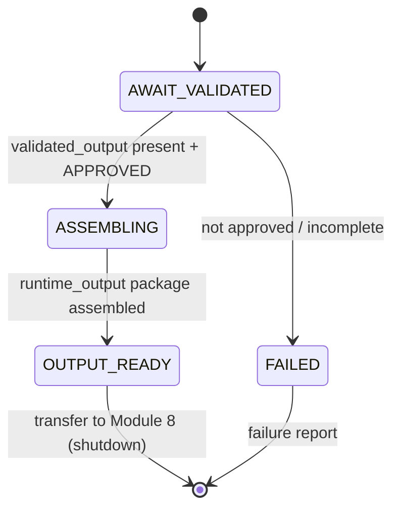

# Module 7 - Output Builder (v1.0)

> **Status:** Specification finalized and validated against the completed Runtime
> Configuration System. Design + finalize step; no redesign of locked components.
> **Registry note:** `module_registry.yaml` (LOCKED v1.0) records this module as
> `runtime.module.output_builder`, `status: planned`. This finalization does **not**
> modify the locked registry; advancing the `status` field is a future coordinated
> registry version bump governed by the locked upgrade policy.
> **Position in chain:** Order 7. Exit module of `mode.validation`. Runs after Module 6;
> transfers control to Module 8 (Runtime Shutdown).

## Purpose

Assemble the **Final Runtime Output** after successful validation by packaging the validated
artifacts into the standardized Runtime response. Module 7 is a **packager**: it composes,
it does not execute, validate, or change anything.

Module 7 is **not** the Master Runtime. It formats the result for return; it makes no
runtime decisions.

## Conformance to Master Runtime Architecture v1.1

Module 7 is the exit module of `mode.validation`. It consumes the approved
`validated_output` from Module 6 and produces the single `runtime_output` artifact, then
hands control to Shutdown. It performs no generation and no validation; per fail-closed
philosophy it proceeds only when the upstream verdict is `approved`.

### Output mapping to the locked Module Registry (no redesign)

The registry fixes Module 7's output as `runtime_output`. This specification's deliverables
map onto it exactly:

| Design-level artifact | Locked registry output it populates |
|---|---|
| Final Runtime Output (container) | `runtime_output` |
| Runtime Summary | `runtime_output.summary` |
| Output Metadata | `runtime_output.metadata` |
| Operator Response | `runtime_output.operator_response` |

## Responsibilities (one responsibility)

**Single responsibility:** *Assemble the Final Runtime Output package from the validated
artifacts.*

Operationally:
- Consume the Validated Output, the Quality Report, and Runtime Metadata.
- Assemble the Final Runtime Output (standardized response envelope).
- Compose the Runtime Summary and Output Metadata.
- Compose the Operator Response (the human-facing result).
- Transfer control to Module 8 (`runtime.module.shutdown`).

## Out of scope

- Generating business content.
- Executing Runtime workflows (Module 5).
- Performing Runtime validation (Module 6).
- Modifying any Runtime Configuration.
- Rewriting, editing, or re-deriving validated artifacts (referenced unchanged).

## Dependencies

| Kind | Value (from LOCKED config) |
|---|---|
| Predecessor module | `runtime.module.quality_gate` |
| Successor module (`next`) | `runtime.module.shutdown` |
| Inputs | `validated_output` (with `quality_report` + runtime metadata carried alongside) |
| Outputs | `runtime_output` |
| Config dependency | `config.repository_map` |
| Operating mode | `mode.validation` (exit module; `next_mode: mode.shutdown`) |

## Runtime Configuration usage

| Component | How Module 7 uses it |
|---|---|
| **Runtime Manifest** | Read (via context) for identity (project/runtime name/version) stamped into Output Metadata, and logging policy. |
| **Repository Map** | Direct dependency: reference validated-artifact locations by logical id when composing the package. No hardcoded paths. |
| **Module Registry** | Confirm predecessor completion and the control-transfer target (`next`). |
| **Execution Modes** | Confirm operation in `mode.validation`; record `next_mode: mode.shutdown`. |
| **Runtime Versions** | Stamp the compatible version set into Output Metadata; confirm compatibility. |

## Validation (fail-closed)

Before assembling, Module 7 verifies:
1. **Module 6 completed** - `validated_output` present.
2. **Validation status APPROVED** - proceeds only on an `approved` verdict.
3. **Configuration compatible** - config passes the Runtime Versions gate.
4. **Output package complete** - all required inputs (validated output, quality report,
   runtime metadata) are present to assemble a complete response.

On any failure (including a non-`approved` verdict): terminate per the Fail Closed Policy -
no recovery, no rewrite - and return a failure report. A partial package is never emitted.

## Final Runtime Output schema

Validated artifacts are referenced unchanged, by logical id where repository-backed.

```yaml
runtime_output:
  output_id: <opaque id>
  status: <success>
  objective: <idea_generation | script_compilation | production_compilation>
  packaged_artifact:
    ref: <validation_result.validated_artifact_ref>   # unchanged, not rewritten
    approval_status: "approved"
    quality_report_ref: <validation_report.report_id>
  summary: <runtime_summary>                            # see below
  metadata: <output_metadata>                           # see below
  operator_response: <operator_response>                # see below
  next_module: "runtime.module.shutdown"
```

## Runtime Summary schema

```yaml
runtime_summary:
  summary_id: <opaque id>
  objective: <idea_generation | script_compilation | production_compilation>
  result: "success"
  modules_executed:
    - "runtime.module.initialization"
    - "runtime.module.context_loader"
    - "runtime.module.state_loader"
    - "runtime.module.decision_engine"
    - "runtime.module.execution_engine"
    - "runtime.module.quality_gate"
    - "runtime.module.output_builder"
  produced_artifact_kind: <idea_brief | script | production_package>
```

## Output Metadata schema

```yaml
output_metadata:
  metadata_id: <opaque id>
  runtime_mode: "mode.validation"
  project_ref: "config.manifest"                       # identity source (no hardcoding)
  config_versions_ref: "config.runtime_versions"
  built_by: "runtime.module.output_builder"
  built_at: <timestamp>
```

## Operator Response

The concise, human-facing message returned to the operator: what objective ran, the result
status, a pointer to the packaged artifact, and the fact that runtime validation passed.
Contains no business-quality judgement and no raw internal logs - only a runtime-level
summary suitable for the operator.

## Failure philosophy

Fail-closed. A non-`approved` verdict, missing inputs, an incomplete package, or an
incompatible configuration terminates the module with a failure report. Validated artifacts
are never modified during packaging.

## Lifecycle position



## Module interface summary

```text
identifier : runtime.module.output_builder
order      : 7
version    : 1.0.0
mode       : mode.validation   (exit module; next_mode: mode.shutdown)
inputs     : validated_output
outputs    : runtime_output
depends_on : runtime.module.quality_gate
next       : runtime.module.shutdown
config     : config.repository_map
```

## Example Final Runtime Output

```text
FINAL RUNTIME OUTPUT (runtime_output)
Output Status : SUCCESS
Objective     : idea_generation
Packaged Artifact : art-idea-7f21 (unchanged, approval_status=approved)
Quality Report    : ref qr-3d10

Runtime Summary:
  result           : success
  modules_executed : init -> context_loader -> state_loader -> decision_engine ->
                     execution_engine -> quality_gate -> output_builder
  produced_artifact_kind : idea_brief

Output Metadata:
  runtime_mode     : mode.validation
  project_ref      : config.manifest
  config_versions  : config.runtime_versions (compatible)
  built_by         : runtime.module.output_builder

Operator Response:
  "Idea generation completed and passed runtime validation. Result artifact art-idea-7f21
   is ready. (Runtime-level result only; no creative judgement.)"

Validation : PASS (Module 6 approved; package complete; config compatible)
Result     : SUCCESS
Next Module : runtime.module.shutdown
```

## Confirmation of production-readiness

The Module 7 specification conforms to Master Runtime Architecture v1.1, consumes all five
configuration components correctly, uses only logical identifiers (no hardcoded paths),
contains no execution/validation/business logic, never rewrites validated artifacts, and
preserves module boundaries. Its output maps exactly onto the locked registry output
`runtime_output`. The specification is **production-ready**. (The locked registry
`status: planned` field is advanced only via a future coordinated registry version bump.)

## Related reading
- [Runtime Architecture v1.1](../docs/Runtime_Architecture_v1.1.md)
- [Runtime Module Overview](../docs/Runtime_Module_Overview.md)
- [Module 6 - Quality Gate](Module_06_Quality_Gate.md)
