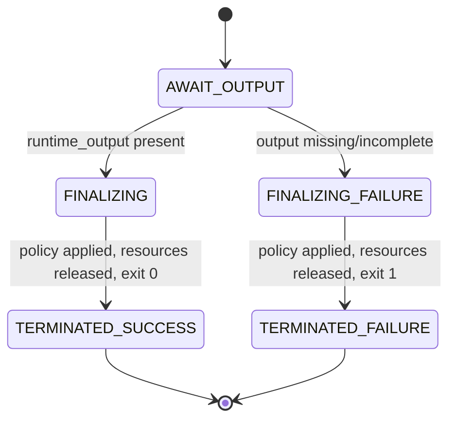

# Module 8 - Runtime Shutdown (v1.0)

> **Status:** Specification finalized and validated against the completed Runtime
> Configuration System. Design + finalize step; no redesign of locked components.
> **Registry note:** `module_registry.yaml` (LOCKED v1.0) records this module as
> `runtime.module.shutdown`, `status: planned`. This finalization does **not** modify the
> locked registry; advancing the `status` field is a future coordinated registry version
> bump governed by the locked upgrade policy.
> **Position in chain:** Order 8. **Terminal module** (`next: null`) of the terminal mode
> `mode.shutdown` (`next_mode: null`). Runs after Module 7.

## Purpose

Cleanly terminate the Runtime execution lifecycle. Module 8 finalizes runtime state, applies
the shutdown policy, releases runtime resources, and records the final execution status. It
closes the run deterministically - it does not execute, validate, or generate.

Module 8 is **not** the Master Runtime. It ends the run correctly; it produces no work.

## Conformance to Master Runtime Architecture v1.1

Module 8 is the terminal state of the runtime lifecycle. It runs in `mode.shutdown`
(`validation_policy.active: false`, `logging` on) and applies
`manifest.execution_policies.shutdown` (`graceful`, `release_context`, deterministic exit
codes). It is the single, well-defined exit point for both successful and failed runs -
consistent with the fail-closed philosophy that every run ends in a known terminal state.

### Output mapping to the locked Module Registry (no redesign)

The registry fixes Module 8's output as `shutdown_report`. This specification's deliverables
map onto it exactly:

| Design-level artifact | Locked registry output it populates |
|---|---|
| Shutdown Report (container) | `shutdown_report` |
| Final Runtime Status | `shutdown_report.final_status` |
| Execution Completion Summary | `shutdown_report.completion_summary` |

## Responsibilities (one responsibility)

**Single responsibility:** *Cleanly terminate the runtime and record the final status.*

Operationally:
- Consume the Final Runtime Output and Runtime Metadata.
- **Runtime state finalization** - mark the runtime state terminal.
- **Shutdown policy application** - apply `manifest.execution_policies.shutdown`
  (`graceful`, exit codes, `release_context`).
- **Runtime resource cleanup** - release context/session/transient resources.
- **Final execution status recording** - record success/failure and exit code.
- Produce the Shutdown Report, Final Runtime Status, and Execution Completion Summary.

There is no control transfer: Module 8 is terminal (`next: null`).

## Out of scope

- Executing Runtime workflows (Module 5).
- Performing Runtime validation (Module 6).
- Modifying Runtime outputs (Module 7's `runtime_output` is referenced unchanged).
- Generating business content.
- Modifying any Runtime Configuration.

## Dependencies

| Kind | Value (from LOCKED config) |
|---|---|
| Predecessor module | `runtime.module.output_builder` |
| Successor module (`next`) | `null` (terminal) |
| Inputs | `runtime_output` (with runtime metadata carried alongside) |
| Outputs | `shutdown_report` |
| Config dependency | `config.manifest` |
| Operating mode | `mode.shutdown` (terminal; `validation.active: false`; `next_mode: null`) |

## Runtime Configuration usage

| Component | How Module 8 uses it |
|---|---|
| **Runtime Manifest** | Direct dependency: apply `execution_policies.shutdown` (`graceful`, `exit_code_success/failure`, `release_context`) and logging policy; read identity for the report. |
| **Repository Map** | Reference the finalized output location by logical id in the report. No hardcoded paths. |
| **Module Registry** | Confirm predecessor completion and terminal position (`next: null`). |
| **Execution Modes** | Confirm operation in `mode.shutdown` (terminal; `next_mode: null`). |
| **Runtime Versions** | Stamp the compatible version set into the Shutdown Report. |

## Validation (fail-closed)

Before shutting down, Module 8 verifies:
1. **Module 7 completed** - `runtime_output` present.
2. **Runtime output finalized** - the output package is complete.
3. **Shutdown policy available** - `manifest.execution_policies.shutdown` is present.
4. **Configuration compatible** - config passes the Runtime Versions gate.

On any failure: apply the shutdown policy in the **failure** path (record failed status,
`exit_code_failure`, still release resources gracefully), and return a failure Shutdown
Report per the Fail Closed Policy. Even failure ends in a clean, recorded terminal state.

## Shutdown Report schema

The `runtime_output` is referenced unchanged; the report never modifies it.

```yaml
shutdown_report:
  report_id: <opaque id>
  runtime_mode: "mode.shutdown"
  finalized_output_ref: <runtime_output.output_id>   # unchanged
  policy_applied:
    graceful: true
    release_context: true
    exit_code: <0 | 1>                                # success | failure
  resources_released:
    context: <released>
    session: <released>
    transient: <released>
  final_status: <final_runtime_status>                # see below
  completion_summary: <execution_completion_summary>  # see below
  recorded_at: <timestamp>
  shutdown_by: "runtime.module.shutdown"
```

## Final Runtime Status schema

```yaml
final_runtime_status:
  status: <completed | failed>
  exit_code: <0 | 1>
  terminal_mode: "mode.shutdown"
  runtime_state: "terminated"
  config_versions_ref: "config.runtime_versions"
```

## Execution Completion Summary

```yaml
execution_completion_summary:
  summary_id: <opaque id>
  objective: <idea_generation | script_compilation | production_compilation>
  result: <success | failure>
  modules_executed:
    - "runtime.module.initialization"
    - "runtime.module.context_loader"
    - "runtime.module.state_loader"
    - "runtime.module.decision_engine"
    - "runtime.module.execution_engine"
    - "runtime.module.quality_gate"
    - "runtime.module.output_builder"
    - "runtime.module.shutdown"
  finalized_output_ref: <runtime_output.output_id>
```

## Failure philosophy

Fail-closed, but always terminal. A missing/incomplete output, an absent shutdown policy, or
an incompatible configuration produces a **failed** Final Runtime Status with
`exit_code_failure`, while still releasing resources gracefully. The runtime never ends in an
undefined state; every run resolves to `completed` or `failed`.

## Lifecycle position



## Module interface summary

```text
identifier : runtime.module.shutdown
order      : 8
version    : 1.0.0
mode       : mode.shutdown   (terminal; next_mode: null)
inputs     : runtime_output
outputs    : shutdown_report
depends_on : runtime.module.output_builder
next       : null            (terminal module)
config     : config.manifest
```

## Example Shutdown Report

```text
SHUTDOWN REPORT (shutdown_report)
Runtime Mode      : mode.shutdown  (terminal)
Finalized Output  : out-9b02 (unchanged)
Policy Applied    : graceful=true, release_context=true, exit_code=0

Resources Released: context=released, session=released, transient=released

Final Runtime Status:
  status         : completed
  exit_code      : 0
  runtime_state  : terminated
  config_versions: config.runtime_versions (compatible)

Execution Completion Summary:
  objective        : idea_generation
  result           : success
  modules_executed : init -> context_loader -> state_loader -> decision_engine ->
                     execution_engine -> quality_gate -> output_builder -> shutdown
  finalized_output : out-9b02

Result : RUNTIME TERMINATED CLEANLY
Next   : null (end of lifecycle)
```

## Confirmation of production-readiness

The Module 8 specification conforms to Master Runtime Architecture v1.1, consumes all five
configuration components correctly, uses only logical identifiers (no hardcoded paths),
contains no execution/validation/business logic, never modifies runtime outputs, applies the
locked shutdown policy, and preserves module boundaries as the terminal node. Its output maps
exactly onto the locked registry output `shutdown_report`. The specification is
**production-ready**. (The locked registry `status: planned` field is advanced only via a
future coordinated registry version bump.)

## Related reading
- [Runtime Architecture v1.1](../docs/Runtime_Architecture_v1.1.md)
- [Runtime Module Overview](../docs/Runtime_Module_Overview.md)
- [Module 7 - Output Builder](Module_07_Output_Builder.md)
