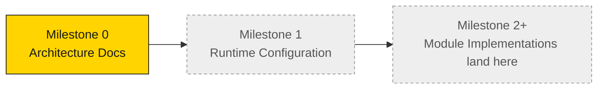

# Runtime Execution Home

This directory is the **execution home** of the Master Runtime — the place where the
runnable runtime (module implementations and orchestration) will live in later milestones.

## Current status

**Empty by design.** This milestone delivers **approved architecture documentation only**.
No executable runtime code and no runtime configuration files are included yet.

## What will land here

- Runtime configuration files (see [Runtime Roadmap → Deferred runtime configuration](../docs/Runtime_Roadmap.md#deferred-runtime-configuration)).
- Executable module implementations, starting with Module 1 (Runtime Initialization).
- The orchestration entry point that drives the module chain in order.

## What must NOT change from here

The runtime consumes the **locked** project architecture and the **approved** runtime
contracts. Implementations placed here must honor:

- the module contracts in [`../modules/`](../modules/),
- the principles in [Runtime Principles](../docs/Runtime_Principles.md),
- the fail-closed lifecycle in [Runtime Architecture v1.1](../docs/Runtime_Architecture_v1.1.md).

## Related reading
- [Master Runtime README](../README.md)
- [Runtime Roadmap](../docs/Runtime_Roadmap.md)
- [Runtime Progress](../docs/Runtime_Progress.md)
