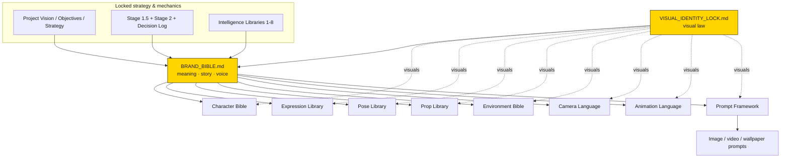

# Brand Bible

> **Status:** Locked · **Applies to:** every video, asset, title, and decision made for the channel ·
> **Owner role:** Brand Strategist / Creative Director / Storytelling Director
>
> **This is the single source of truth for *who the channel is*** — why it exists, who it serves,
> how it feels, how its stories work, and how it speaks. Where the
> [Visual Identity Lock](VISUAL_IDENTITY_LOCK.md) governs *how everything looks*, this Brand Bible
> governs *what the channel means and how it behaves*. Together they are the **Identity Core** that
> every future creative document inherits from.

## What this document is (and is not)

- **It is** an internal operating manual for creators, AI systems, prompt engineers, editors,
  designers, and future automation — so any of them can produce a video that unmistakably belongs to
  the same universe.
- **It is not** a marketing deck, and it is **not** a place to re-decide strategy. Every strategic
  decision here is already **locked** elsewhere in the repository; this document *consolidates* the
  brand-relevant essence and makes it operational. It **references** rather than **restates**:
  - Strategy & business → [Project Vision](../../docs/01-project-vision.md),
    [Objectives](../../docs/02-objectives.md), [Business Strategy](../../docs/20-business-strategy.md),
    [Stage 1.5](../../docs/11-stage-1_5-business-decisions.md),
    [Decision Log](../../docs/21-decision-log.md).
  - Operations & QA → [Stage 2 — Channel Operating System](../../docs/12-stage-2-channel-operating-system.md).
  - Storytelling mechanics → [Intelligence Libraries 1–6](../../intelligence/README.md).
  - Visual law → [Visual Identity Lock](VISUAL_IDENTITY_LOCK.md).
- It fills the gap left by the "Channel DNA" summary in
  [Stage 1.5](../../docs/11-stage-1_5-business-decisions.md) and the "channel bible" line item in
  [Stage 2](../../docs/12-stage-2-channel-operating-system.md): both *named* a brand identity but
  neither made its personality, emotional design, voice, and content boundaries explicit and
  reusable. This document does — **without re-opening any locked decision**
  ([Locked Roadmap](../../docs/03-locked-roadmap.md)).

> **Working brand name:** *Plot Twist Pals* (placeholder, per
> [Stage 1.5 Channel DNA](../../docs/11-stage-1_5-business-decisions.md)). **Recurring cast (Phase 1):**
> [PIP](../characters/pip.md) — the lovable underdog and channel face — and
> [CHIEF](../characters/chief.md) — the pompous authority foil.

---

## Table of contents

1. [Purpose](#purpose)
2. [Mission](#mission)
3. [Vision](#vision)
4. [Core Values](#core-values)
5. [Brand Personality](#brand-personality)
6. [Audience Definition](#audience-definition)
7. [Emotional Design](#emotional-design)
8. [Storytelling Philosophy](#storytelling-philosophy)
9. [Content Pillars](#content-pillars)
10. [Brand Recognition System](#brand-recognition-system)
11. [Brand Voice](#brand-voice)
12. [Brand Consistency Rules](#brand-consistency-rules)
13. [Decision Framework](#decision-framework)
14. [Relationship With Existing Documents](#relationship-with-existing-documents)
15. [Repository Integration](#repository-integration)
16. [Change Control](#change-control)

---

## Purpose

**Why the channel exists.** C-Cloning's channel exists to deliver a *guaranteed small joy* — a laugh
plus a satisfying surprise — to a global audience in under 45 seconds, produced at industrial scale by
an evidence-based system rather than by creative luck (see
[Project Vision](../../docs/01-project-vision.md)). It is a faceless, AI-produced, twist-ending
animated-comedy channel whose reason for being is to prove that *virality is engineered, not stumbled
into*, and to build a recurring cast the world recognizes and returns to.

**Why viewers should care.** In a feed built to be endlessly scrolled, the channel promises the
scarcest thing: a payoff. Every Short is a tiny, complete story that *pays off* — no cliffhanger, no
bait, no wasted seconds. Viewers care because the channel reliably respects their time and rewards it
with a clean surprise and a hit of justice.

**What emotional value it provides.** A **safe, wholesome dopamine loop**: the tension of watching
someone overreach, the delight of an unexpected reversal, and the deep satisfaction of *fair, bloodless
karma*. It is comfort comedy — dependable, repeatable, and never mean. That emotional reliability is
the product; the animation is just its delivery vehicle.

---

## Mission

> **Deliver a guaranteed laugh plus a surprise in under 45 seconds, at industrial scale, using a
> recurring cast the world recognizes — while remaining advertiser-safe for maximum revenue per view.**
> *(from [Project Vision](../../docs/01-project-vision.md))*

**The promise made to viewers — the "Plot Twist Pals Promise":**

1. **Every video ends with a real twist.** No exceptions ([D-08](../../docs/21-decision-log.md)).
2. **The payoff is fair and bloodless.** Karma lands on the deserving; the underdog is never
   humiliated ([Library 3](../../intelligence/03-narrative-twist-library.md)).
3. **It works with the sound off, anywhere on Earth.** Mute-first, language-free
   ([Stage 2](../../docs/12-stage-2-channel-operating-system.md)).
4. **The same pals will be back tomorrow.** A dependable cast and a dependable daily rhythm.
5. **Your time is respected.** A hard cut on the reveal — no dragging, no filler.

Breaking any one of these breaks the brand contract, regardless of views.

---

## Vision

> **Become the most-watched faceless AI twist-comedy studio: Shorts today, a multi-format AI animation
> company tomorrow.** *(from [Project Vision](../../docs/01-project-vision.md))*

Over the next several years the brand should evolve along the locked
[scaling ladder](../../docs/32-future-expansion.md) **without ever losing its identity**:

- **Now — the recognizable Short.** One channel, a daily twist-comedy habit, a cast (PIP & CHIEF)
  people learn to love.
- **Next — a franchise.** A larger recurring ensemble, long-form expansions of hit Shorts, and the
  cast becoming characters people follow across formats and buy merch of
  ([Future Expansion](../../docs/32-future-expansion.md)).
- **Later — a universe / studio.** Multiple channels and languages cloned from the same intelligence
  system, all sharing the same comedic DNA, tone, and quality bar.

The **brand identity defined in this document is the constant** across all of it. Tooling, team size,
formats, and node scores change; *who the channel is* does not.

---

## Core Values

The non-negotiable principles behind every piece of content. The first five are inherited verbatim
from the [Project Vision "Core philosophy"](../../docs/01-project-vision.md); the rest translate the
locked operating rules into brand values.

| Value | What it means for content |
|---|---|
| **Structure over luck** | We compute what to make; we never gamble on "maybe this goes viral." |
| **Knowledge is compounding IP** | Every learning is stored and reused; nothing is discovered twice. |
| **Determinism over brainstorming** | Ideas come from the [Content Matrix](../../intelligence/08-content-matrix.md), not from vibes. |
| **Speed and reuse** | Simple, reusable assets beat expensive polish — always. |
| **Originality as law** | Original scripts, cast, and voice protect monetization ([D-06](../../docs/21-decision-log.md)). |
| **The twist is sacred** | No video ships without a genuine, seeded reversal ([D-08](../../docs/21-decision-log.md)). |
| **Kind at the core** | The humor is *benign* — we laugh *with* the underdog and *at* deserved arrogance, never at cruelty. |
| **Advertiser-safe by design** | Clean humor is a feature and a moat, not a limitation ([D-03](../../docs/21-decision-log.md)). |
| **Global by default** | If it needs language or local context to be funny, it isn't for us. |
| **Respect the viewer's time** | A hard cut on the reveal; every second earns its place. |
| **Consistency is the product** | A new video must feel like it belongs to every previous one. |

---

## Brand Personality

**If the brand were a person:** a quick-witted, warm-hearted street-corner mime who tells perfect
little stories with a shrug and a raised eyebrow — never says much, never needs to, and always leaves
you grinning. Clever but never smug, mischievous but never cruel, and reliably on the side of the
little guy.

| Dimension | Setting | Notes |
|---|---|---|
| **Communication style** | Show, don't tell | Visual-first, minimal words; the *situation* speaks. Mute-readable by law. |
| **Emotional style** | Warm, playful, reassuring | Tension is always resolved; the viewer is left safe and satisfied. |
| **Humor style** | **Dark-*lite*** absurdist twist comedy | Ironic, karmic, surprising — but bloodless and benign ([D-03](../../docs/21-decision-log.md), [Library 2](../../intelligence/02-comedy-mechanics-library.md)). Punch *up* at arrogance, never *down* at the weak. |
| **Energy level** | Brisk and snappy | Pose-to-pose, escalating, with one deliberate silent beat before the turn. Never frantic, never sluggish. |
| **Optimism** | High | The world is fair here; wrongdoing gets its comeuppance and kindness is rewarded. |
| **Warmth** | High | PIP is genuinely lovable; even CHIEF is a "villain you enjoy," not one you hate. |
| **Intelligence** | High, worn lightly | The cleverness lives in the *seed* and the *reversal*, not in showing off. The viewer feels smart for catching it. |
| **Attitude toward the viewer** | Generous host | We hand you a complete, satisfying gift every time and invite you back tomorrow. |

**Personality guardrails:** never mean-spirited, never edgy-for-shock, never cynical, never
condescending, never political, never trend-desperate. If a creative choice would make the brand-person
seem cruel, crude, or try-hard, it is off-brand.

---

## Audience Definition

Grounded in [Stage 1.5 Channel DNA](../../docs/11-stage-1_5-business-decisions.md) (audience: global,
16–34, meme-native) and the behavior model in
[Library 5 — Viewer Psychology](../../intelligence/05-viewer-psychology-library.md).

**Primary audience.** Global, mobile-first short-form viewers roughly **16–34**, meme-native, scrolling
feeds (YouTube Shorts first; the format also travels to TikTok/Reels). They do not need a shared
language or culture — the comedy is visual and universal.

**Secondary audience.** Anyone from ~8 to ~80 who enjoys clean, wholesome, family-safe cartoon comedy —
the broad "advertiser-safe general audience" that a parent could watch beside a child. This width is
deliberate: it is what protects RPM and sponsor-friendliness.

**Viewer motivations (why they watch a given Short):**
- A quick, reliable laugh during idle scrolling.
- The satisfaction of *justice* — watching arrogance get its comeuppance.
- The "I didn't see that coming — wait, it was there the whole time" delight of a seeded twist.
- A safe, low-stakes emotional hit with zero risk of being disturbed or offended.

**Why they return (the loyalty engine):**
- **The cast.** PIP and CHIEF become familiar friends/foils; viewers come back for *them*
  ([D-02](../../docs/21-decision-log.md)).
- **The dependable promise.** Every video pays off — trust is built through consistency.
- **The daily rhythm.** A habit forms around a reliable, always-on-brand upload cadence.

**Emotional needs the channel satisfies:** the need for *fairness* in a chaotic feed, the comfort of
*predictable delight*, the small ego-reward of *catching the seed*, and the belonging of a *recurring
cast* to root for.

---

## Emotional Design

The intended emotional arc, mapped to the measurable behaviors it must produce (behavior model and
value ranking from [Library 5](../../intelligence/05-viewer-psychology-library.md):
`Anti-Swipe > Completion > Replay > Share > Subscribe > Comment > Return > Like`).

| Moment | What the viewer should **feel** | Behavior it must drive |
|---|---|---|
| **Before clicking** (thumbnail / first frame in feed) | Instant curiosity + a familiar "oh, it's *them*" recognition; a sense that something is about to go wrong for someone who deserves it. | **Anti-swipe** (stop the scroll) |
| **During the Short** | Rising, safe tension; amusement at the escalation; a confident (wrong) prediction of how it ends; a held breath at the silent beat. | **Completion** (watch to the end) |
| **At the twist** | Surprise → recognition → *satisfaction* ("that's fair and perfect"); the itch to see the setup again. | **Replay** + **Share** |
| **After finishing** | A clean, warm "that was worth it," a smile, and zero residue of discomfort. | **Share** ("you have to see this") + **Subscribe** (want more of the pals) |
| **Days later** | Fond memory of the cast and the *format* ("the channel where the jerk always gets it"); anticipation of the next one. | **Return** + **Subscribe retention** |

**Design rule:** always design for the *action*, never merely for the feeling — the feeling is the
means, the behavior is the product ([Library 5 founding law](../../intelligence/05-viewer-psychology-library.md)).
Every Short must move a viewer through *all* of these moments; a missing moment is a leaked behavior.

---

## Storytelling Philosophy

The brand's narrative soul. The *mechanics* are fully specified in the intelligence libraries — this
section defines the **brand stance** on each and links to the machinery rather than repeating it.

- **Conflict.** Always a **status gap**: someone with power/advantage vs. someone smaller. Conflict is
  situational and visual, never verbal or ideological. (Scenario engine:
  [Library 4](../../intelligence/04-scenario-intelligence-library.md).)
- **Emotional rhythm.** Set a confident expectation → let arrogance escalate → **one deliberate beat of
  silence** → reversal → warm button. The silence before the turn is a signature brand instrument.
- **Pacing.** Brisk, pose-to-pose, 3–5 scenes, 2–4s shots, a hard ending — per the
  [Stage 2 Shorts framework](../../docs/12-stage-2-channel-operating-system.md). No dragging; no filler.
- **Surprise.** Every video is built on **one** seeded reversal — *unpredictable in foresight,
  inevitable in hindsight* ([Seeded Reversal Framework, Library 3](../../intelligence/03-narrative-twist-library.md)).
  Never two twist cores; never a random or unfair surprise.
- **Payoff.** Comedy is delivered by **one dominant mechanic** (usually Overconfidence Collapse,
  Instant Karma, or Irony) per the
  [Company Comedy Stack, Library 2](../../intelligence/02-comedy-mechanics-library.md). The payoff is
  the highest-leverage second of the video and must feel *earned*.
- **Justice.** The brand's moral spine: **karma is fair and proportionate**. The arrogant character's
  *own* action causes their downfall; the underdog never retaliates — the *twist* delivers justice, so
  the underdog stays likeable ([PIP model sheet](../characters/pip.md),
  [Library 6 NP1 Comeuppance](../../intelligence/06-narrative-pattern-library.md)).
- **Wholesomeness.** Bloodless, benign, advertiser-safe. The violation is always *safe*
  ([Library 2 first principle](../../intelligence/02-comedy-mechanics-library.md)). We punch up, never
  down.
- **Rewatchability.** Engineered, not hoped for: the **seed** in the opening frame rewards a rewatch,
  and the **last frame matches the first** for a seamless loop
  ([Visual Identity Lock — Composition](VISUAL_IDENTITY_LOCK.md#composition-rules),
  [V1 Series Bible](../../V1/08-series-bible.md)).

---

## Content Pillars

The **permanent categories** of content that belong to this brand. Every one is a locked *narrative
pattern* from [Library 6](../../intelligence/06-narrative-pattern-library.md); the brand does not invent
new pillars ad hoc — it selects among these.

| Pillar (pattern) | Brand role | Tier |
|---|---|---|
| **Comeuppance** (NP1) | The flagship: arrogance abuses power → instant, fair payback. Idea [A1](../A1-first-video/README.md) is the archetype. | Daily engine |
| **Underdog Reversal** (NP2) | The little guy quietly wins; best for building love for the cast → subscribes. | Daily engine |
| **Overreach Collapse** (NP3) | Greed/ego escalates until it topples itself; spectacle share. | Daily engine |
| **Hidden Truth** (NP4) | A reframe recontextualizes everything; premium replay. | Premium / replay |
| **Bait-and-Switch** (NP7) | The setup deliberately misleads; premium replay. | Premium / replay |
| **Escalating Disaster** (NP5) | A small problem snowballs comically; variety/spectacle. | Variety |
| **Ironic Backfire** (NP8) | A scheme rebounds on its schemer; variety. | Variety |

> Everyday **settings** (parking lot → beach, office, zoo, gym, …) are *variables*, not pillars: the
> [V1 Series Bible](../../V1/08-series-bible.md) locks that only the situation and the twist change
> between videos while the cast and format stay constant.

**Topics that must NEVER appear** (brand-level "no-fly list," consolidating
[Objectives non-goals](../../docs/02-objectives.md),
[Stage 2 non-negotiables](../../docs/12-stage-2-channel-operating-system.md), and the
[Decision Log rejected list](../../docs/21-decision-log.md)):

- **Gore, violence with real harm, or anything frightening/unsafe.** Karma is always bloodless.
- **Cruelty to the sympathetic/weak,** humiliation of the underdog, or "punching down."
- **Edgy/shock humor, sexual content, slurs, or hateful content.**
- **Politics, religion, tragedy, or real-world sensitive events.**
- **Lifted IP, memes, characters, logos, or copyrighted music/audio.**
- **Region- or language-locked jokes** that don't read globally or muted.
- **Trend-chasing as the core premise** (a trend may only skin a setup, never be the point).
- **Cliffhangers or bait with no payoff,** or any video without a genuine twist.
- **Optimizing for Likes** as a goal (weakest signal; [Library 5](../../intelligence/05-viewer-psychology-library.md)).

---

## Brand Recognition System

Within **2–3 seconds**, muted, a stranger should know a Short is ours. Recognition is carried by a
stack of locked signals. Visual signals **defer entirely** to the
[Visual Identity Lock](VISUAL_IDENTITY_LOCK.md) — they are listed here only to show how they combine
with the non-visual signals into one identity.

| Layer | Recognition signal | Authority |
|---|---|---|
| **Visuals** | Flat-2D, uniform thick `INK` outline, `BRAND_YELLOW`-anchored palette on warm `PAPER`, chunky silhouettes | [Visual Identity Lock](VISUAL_IDENTITY_LOCK.md) |
| **Characters** | The recurring cast — PIP (small, round, teal scarf) & CHIEF (rotund, cap + yellow medal sash) | [Character model sheets](../characters/README.md) |
| **Story rhythm** | Confident setup → escalation → silent beat → seeded reversal → warm button | [Library 6 USA](../../intelligence/06-narrative-pattern-library.md) |
| **Structure** | ~25–40s, one twist, hard cut on the reveal, first frame = last frame (loop) | [Stage 2](../../docs/12-stage-2-channel-operating-system.md) · [V1 Series Bible](../../V1/08-series-bible.md) |
| **Humor** | Fair, bloodless karma against arrogance; benign surprise | [Library 2](../../intelligence/02-comedy-mechanics-library.md) |
| **Editing** | Snappy pose-to-pose cuts, no dissolves, one deliberate silence before the turn | [A1 editing spec](../A1-first-video/07-editing-spec.md) |
| **Music / SFX** | Light comedic bed, a hard silence beat, a punchy impact/reversal sting on the twist | [A1 audio package](../A1-first-video/06-audio-package.md) |
| **Camera language** | Wide establishing → escalation framing → low hero angle on the flex → punch-in on the twist | [Camera & Cinematography Bible](CAMERA_CINEMATOGRAPHY_BIBLE.md) (formalized) · [A1 storyboard](../A1-first-video/03-storyboard.md) |
| **Publishing** | Title style (curiosity + karma + one emoji + `#shorts`) and a fixed hashtag set | [Brand Voice](#brand-voice) below |

**The single most recognizable thing:** *the pals + the karmic twist.* If a video has neither our cast
nor a fair, seeded reversal, it is not a C-Cloning Short — no matter how on-model the art is.

---

## Brand Voice

How the channel *speaks* — in the rare on-screen words and in everything around the video. The channel
is **visual-first and mute-first**, so voice is deliberately sparse; when it does appear, it is warm,
playful, and curiosity-driven.

- **Writing philosophy.** Let the situation talk. Words are a last resort, never a crutch. If a line
  is needed to understand the story, the *story* is broken (mute-first law,
  [Stage 2](../../docs/12-stage-2-channel-operating-system.md)).
- **Narration philosophy.** Default is **no narration**. The
  [comedy anatomy](../../intelligence/02-comedy-mechanics-library.md) is carried by pose, timing, and
  the visual surprise — not by a voice explaining the joke.
- **Dialogue philosophy.** Minimal, visual-led, and typically **wordless** (grunts, gasps, a single
  reaction sound). When a fixed cast voice is used later, it reuses one locked voice per character via
  ElevenLabs ([D-20](../../docs/21-decision-log.md)); it never carries the plot.
- **On-frame text.** Rare and deliberate — a bold, chunky `INK` word (optionally on a `BRAND_YELLOW`
  pill), per the [Visual Identity Lock rendering rules](VISUAL_IDENTITY_LOCK.md#rendering-rules) and
  [thumbnail spec](../templates/thumbnail-spec.md). Curiosity, never spoiler (e.g. `WRONG MOVE`, not
  `HE GETS TOWED`).
- **Titles.** Curiosity + payoff promise, **one** emoji, `#shorts`, ≤ ~60 characters, and **never**
  spoil *how* the twist lands. Pattern (from the [A1 publish package](../A1-first-video/08-publish-package.md)):
  `He Booted the Wrong Scooter 😳 #shorts`.
- **Descriptions.** A fixed shape: a one-line hook → a **replay nudge** that points at the seed
  ("watch the first second again 👀") → a **comment CTA** → the canonical hashtag block. Warm, light,
  emoji-accented.
- **Hooks (first 0–2s).** The visual sets the conflict and hides the seed instantly; the "hook" is a
  *frame*, not a sentence. It must beat the swipe on its own.
- **CTAs.** Friendly and low-pressure, framed around the cast and the format — e.g. *"Which pal
  deserves the next comeuppance? 👇"* Never begging for likes/subs; invite participation instead.
- **Canonical hashtag set (channel default, reuse every video):**
  `#shorts #animation #cartoon #comedy #plottwist #karma #funny #instantkarma #satisfying #toon`
  (1 format + 3 genre + 3 twist/payoff + 3 discovery; from the
  [metadata template](../templates/metadata-template.md) and
  [A1 publish package](../A1-first-video/08-publish-package.md)).

**Tone words:** warm · playful · clever · satisfying · wholesome · brisk.
**Anti-tone words:** edgy · cynical · cruel · preachy · clickbait · verbose.

---

## Brand Consistency Rules

The fast DO / DON'T reference. Visual consistency is governed separately by the
[Visual Identity Lock consistency rules](VISUAL_IDENTITY_LOCK.md#consistency-rules); these are the
*brand / story / voice* rules.

### Always
- **Always** end on one genuine, **seeded** twist with a hard cut.
- **Always** make the payoff *fair and bloodless* — karma lands on the deserving.
- **Always** keep the underdog sympathetic; let the *twist* (not the underdog) deliver justice.
- **Always** make the story readable **muted** and **globally**, with no language dependency.
- **Always** reuse the locked cast, format, title style, and hashtag set.
- **Always** design each beat for a **measurable behavior** ([Library 5](../../intelligence/05-viewer-psychology-library.md)).
- **Always** keep it advertiser-safe and family-watchable.

### Never
- **Never** ship a video without a twist, or with two twist cores.
- **Never** use gore, cruelty, shock, sexual, hateful, political, or religious content.
- **Never** punch down, humiliate the weak, or make the underdog the butt of the joke.
- **Never** lift IP, memes, characters, or copyrighted music/audio.
- **Never** rely on a trend as the *premise* (only as a swappable setup skin).
- **Never** spoil the twist in the title or thumbnail.
- **Never** redesign the cast or the format to chase a single video's idea.
- **Never** optimize for Likes as a goal.

### Avoid
- Avoid dialogue or narration that the visuals could carry instead.
- Avoid slow openings — the seed and conflict must land in the first 0–2s.
- Avoid region-specific or era-specific references that won't travel or age.
- Avoid stacking multiple comedic mechanics (one dominant mechanic per video).
- Avoid cynicism, meanness, or "try-hard" edginess in copy and CTAs.

### Preferred
- Prefer a *visual* joke over a written one; a *pose* over a line.
- Prefer the daily-engine pillars (Comeuppance / Underdog / Overreach) for volume; use premium
  replay pillars (Hidden Truth / Bait-and-Switch) for variety.
- Prefer reusing cast/props/settings over inventing new ones (the reuse cost moat,
  [D-07](../../docs/21-decision-log.md)).
- Prefer curiosity over spectacle in titles/thumbnails; let the video over-deliver.

---

## Decision Framework

When making *any* future creative decision — a new idea, a script choice, a title, a thumbnail, a new
cast member, a format tweak — evaluate it in this order. The framework layers a **brand lens** on top
of the existing operational [Stage 2 5-Gate test](../../docs/12-stage-2-channel-operating-system.md);
it does not replace it.

**Step 1 — Brand-fit gate (this document).** Ask, in order:
1. **On-identity?** Does it fit the [personality](#brand-personality) (warm, clever, benign) and serve
   the [mission promise](#mission)?
2. **On-pillar?** Is it one of the [content pillars](#content-pillars), and clear of the never-list?
3. **On-emotion?** Does it move the viewer through the [emotional arc](#emotional-design) toward a
   real behavior?
4. **On-story?** Does it have exactly one fair, **seeded** twist and read muted + globally?
5. **On-look & voice?** Does it obey the [Visual Identity Lock](VISUAL_IDENTITY_LOCK.md) and the
   [Brand Voice](#brand-voice)?

   *Any "no" → reject or rework. The brand gate is a veto.*

**Step 2 — Operating gate (Stage 2).** If it passes Step 1, run the locked
[5-Gate test](../../docs/12-stage-2-channel-operating-system.md): does it increase speed/volume, is it
reusable/scalable, does it protect originality/monetization, is it low-cost in Phase 1, and does it
improve retention/CTR? *Failing gate 1, 2, or 3 → reject.*

**Step 3 — Generation (not invention).** If a new *idea* is needed, do not brainstorm — query the
[Content Matrix](../../intelligence/08-content-matrix.md) with a business goal and take the
highest-scoring valid combination ([Stage 4](../../docs/13-stage-4-idea-generator.md)).

**Step 4 — Compiler discipline.** Downstream stages **compile**, never redesign: the locked idea
parameters are immutable; issues are *reported*, not silently fixed
([D-19](../../docs/21-decision-log.md), [Stage 5](../../docs/14-stage-5-script-compiler.md) /
[Stage 6](../../docs/15-stage-6-production-compiler.md)).

> **Tie-breaker heuristic:** when two on-brand options remain, choose the one that makes a future video
> *more consistent* with past videos. Consistency is the product.

---

## Relationship With Existing Documents

This Brand Bible is one half of the **Identity Core**, alongside the
[Visual Identity Lock](VISUAL_IDENTITY_LOCK.md). Everything creative in the repository flows from these
two roots.

### What this Brand Bible inherits (and defers to)

| Inherited from | What it provides to this document |
|---|---|
| [Visual Identity Lock](VISUAL_IDENTITY_LOCK.md) | **All visual law** — shape, line, color, lighting, composition, rendering, brand-recognition visuals. This Bible never overrides a visual rule; it points to the Lock. |
| [Project Vision](../../docs/01-project-vision.md) · [Objectives](../../docs/02-objectives.md) · [Business Strategy](../../docs/20-business-strategy.md) | Mission, vision, values, phase goals, monetization stance. |
| [Stage 1.5](../../docs/11-stage-1_5-business-decisions.md) · [Stage 2](../../docs/12-stage-2-channel-operating-system.md) · [Decision Log](../../docs/21-decision-log.md) | Channel DNA, non-negotiables, the 5-Gate test, and every locked decision. |
| [Intelligence Libraries 1–6](../../intelligence/README.md) | The storytelling, comedy, twist, scenario, psychology, and pattern mechanics referenced here. |
| [Stage 1](../../docs/10-stage-1-competitor-intelligence.md) | Audience assumptions and the four proven engines. |

> **Precedence:** on a **visual** question, the [Visual Identity Lock](VISUAL_IDENTITY_LOCK.md) wins.
> On a **strategy / operations** question, the locked stages & libraries win. This Bible is the
> authority on **brand meaning, personality, story stance, content boundaries, and voice**, and it must
> never contradict the locked sources — if a conflict is found, it is a bug in this document.

### What future documents must inherit from this Brand Bible

Every future creative document inherits from **both** roots: this Brand Bible (meaning, behavior,
story, voice) **and** the Visual Identity Lock (appearance).

| Future document | Inherits from this Brand Bible | Also inherits visuals from |
|---|---|---|
| Character Bible | Personality archetypes, cast roles, moral function (who we root for/against), voice | [Visual Identity Lock](VISUAL_IDENTITY_LOCK.md) |
| Expression Library | Which emotions the brand needs and *why* (the emotional-design arc) | Visual Identity Lock |
| Pose Library | Story beats & status cues poses must convey (setup/escalation/flex/shock) | Visual Identity Lock |
| Prop Library | Which props serve the pillars & seeds (power objects, karma devices) | Visual Identity Lock |
| Environment Bible | Setting-as-variable rules; global, non-region-locked worlds | Visual Identity Lock |
| Camera Language | Shot grammar that serves the emotional rhythm & twist reveal | Visual Identity Lock |
| [Animation Language & Motion System](ANIMATION_LANGUAGE_MOTION_SYSTEM.md) ✅ | Timing, the silent beat, snappy pacing, the loop | Visual Identity Lock |
| Prompt Framework | Encodes brand tone + story rules + visual law into generation prompts | Visual Identity Lock |

### Dependency graph

---

## Repository Integration

This Bible is designed to slot in without duplication. Additive one-line pointers are added in this
branch at the highest-traffic entry points; deeper cross-links are left as recommendations to avoid
over-editing locked documents.

| Document | Relationship | Action |
|---|---|---|
| [`production/design/README.md`](README.md) | Design/identity folder index | Add the Brand Bible + dependency note (done in this branch) |
| [`production/design/VISUAL_IDENTITY_LOCK.md`](VISUAL_IDENTITY_LOCK.md) | Sibling root (the other half of the Identity Core) | Add a one-line "paired with the Brand Bible" note (done) |
| [`docs/00-index.md`](../../docs/00-index.md) | Master doc map | Add a Brand Bible entry under Design standards (done) |
| [`production/README.md`](../README.md) | Production folder map | Note the Brand Bible in the `design/` tree (done) |
| [`docs/01-project-vision.md`](../../docs/01-project-vision.md) | Source of mission/vision/values | Recommend a "operationalized in the Brand Bible" pointer (follow-up) |
| [`V1/08-series-bible.md`](../../V1/08-series-bible.md) | Per-series restatement of identity | Recommend a "power-user" pointer to this Bible (follow-up) |
| Future [Character Bible / libraries] | Children of this Bible | Must open with an inheritance banner referencing this document |

**No duplication guarantee.** Mechanics (comedy stack, twist framework, patterns, scoring), operational
rules (cadence, QA gate, asset naming), and visual rules are **referenced, not restated**. This document
only owns the connective identity layer — personality, emotional design, content boundaries, voice, and
the decision/inheritance framework — that no existing document owned.

---

## Change Control

This is a **locked** identity document, governed like the
[Locked Roadmap](../../docs/03-locked-roadmap.md) and
[Decision Log](../../docs/21-decision-log.md).

- **Editorial changes** (clarifications, examples, new cross-links) may be made freely; no version bump.
- **Substantive changes** (mission, values, personality, audience, pillars, the never-list, voice
  rules) require: (1) a rationale recorded in the [Decision Log](../../docs/21-decision-log.md), (2) a
  pass through the [Stage 2 5-Gate test](../../docs/12-stage-2-channel-operating-system.md), and (3) a
  confirmation that no [locked decision](../../docs/03-locked-roadmap.md) is being re-opened.
- **New content pillars or cast archetypes** must be added here (and, for cast, in the future Character
  Bible) **before** they may be produced.

> **The brand is the product.** When in doubt, choose the option that makes the next video feel more
> like it belongs to the same universe as the first one.
