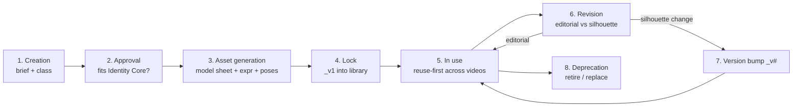
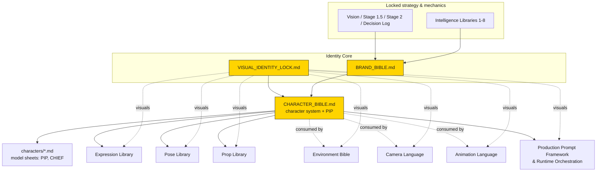

# Character Bible

> **Status:** Locked · **Applies to:** every character that will ever appear in a C-Cloning video —
> recurring cast, one-offs, and background crowds · **Owner role:** Lead Character Designer /
> Narrative Designer / Asset System Architect
>
> **This is the single source of truth for the C-Cloning character system** — how characters are
> classified, created, approved, versioned, prompted, and retired, and the rules that keep them
> identical across hundreds of videos. It is **not** only about PIP: PIP is documented here as the
> **first complete implementation** of the system so every future character has a worked reference.

## Inheritance banner

This document is a **child of the [Identity Core](README.md)** and inherits everything from both roots;
it never overrides them:

- **Appearance** → the [Visual Identity Lock](VISUAL_IDENTITY_LOCK.md). All shape, line, color,
  lighting, composition, and rendering rules are inherited. This Bible adds *character-specific* design
  intent, not new visual law. On a visual question, the Lock wins.
- **Meaning, story, voice** → the [Brand Bible](BRAND_BIBLE.md). Character roles, moral function,
  personality tone, and behavior serve the brand's
  [personality](BRAND_BIBLE.md#brand-personality), [storytelling philosophy](BRAND_BIBLE.md#storytelling-philosophy),
  and [content pillars](BRAND_BIBLE.md#content-pillars). On a brand/story question, the Brand Bible wins.

It also **defers to** (references, never restates):
- Asset naming & reuse → [Stage 2](../../docs/12-stage-2-channel-operating-system.md).
- The shared art grammar for the cast → [Cast Style Guide](../characters/cast-style-guide.md).
- Existing per-character model sheets → [characters/](../characters/README.md)
  ([CHIEF](../characters/chief.md), [PIP](../characters/pip.md)).
- Ready-to-paste prompt scaffolds → [visual-prompt template](../templates/visual-prompt-template.md)
  and [V1 character prompts](../../V1/02-characters-and-reactions.md).

> **Architecture note.** This Bible (in `production/design/`) is the **system/standard**. The files in
> [`production/characters/`](../characters/README.md) are its **implementations** — one model sheet per
> character. When the two overlap, this Bible owns the *character architecture and profile*; the model
> sheets own the *exact locked visual spec* (hex values, measurements) and are referenced rather than
> duplicated.

---

## Table of contents

1. [Purpose](#purpose)
2. [Character System](#character-system)
3. [Character Taxonomy](#character-taxonomy)
4. [Character Lifecycle](#character-lifecycle)
5. [Character Asset Standards](#character-asset-standards)
6. [Character Naming Standards](#character-naming-standards)
7. [Character Consistency Rules](#character-consistency-rules)
8. [Character Prompt Standards](#character-prompt-standards)
9. [Character Quality Checklist](#character-quality-checklist)
10. [Character Validation Workflow](#character-validation-workflow)
11. [PIP — first full implementation](#pip)
12. [Future Character Template](#future-character-template)
13. [Relationship With Existing Documents](#relationship-with-existing-documents)
14. [Repository Integration](#repository-integration)
15. [Change Control](#change-control)

---

## Purpose

Character consistency is the channel's loyalty engine and its second-hardest-to-copy moat (after
writing the twist). The [Brand Bible](BRAND_BIBLE.md#audience-definition) establishes that viewers
subscribe to a **recurring cast**, not to single videos, and that the cast is a locked business
decision ([D-02](../../docs/21-decision-log.md)) that competitors running twists on generic characters
forfeit. At a target of 10–14 videos per week for years, "the same character every time" cannot be left
to memory or vibes — it must be an **engineered system**.

This document exists so that:

- **Recognition compounds.** A viewer must recognize PIP (or any cast member) instantly, in any video,
  muted, at thumbnail size. Drift in silhouette, palette, or behavior erodes the one asset the channel
  is built on.
- **Reuse stays cheap.** The [Stage 2 reuse economics](../../docs/12-stage-2-channel-operating-system.md)
  (~70% asset reuse, sub-30-minute videos) depend on characters being *reused*, never redrawn.
- **Scale stays on-model.** New operators, new tools, and future automation
  ([Stage 2 automation roadmap](../../docs/12-stage-2-channel-operating-system.md)) must all produce
  identical characters without re-deciding anything.
- **Growth is possible without dilution.** As the cast expands toward the
  [franchise/universe vision](BRAND_BIBLE.md#vision), every new character must slot into one
  classification, one lifecycle, and one quality bar.

> **Rule of thumb:** if a returning viewer could not name the character on sight, or if a new character
> could be confused for an existing one, the character system has failed.

---

## Character System

C-Cloning uses a **small fixed cast + disposable extras** model. The value lives in the recurring cast;
everything else is deliberately minimal so it never competes with the leads or slows production.

| Class of participant | Definition | Persistence | Gets a model sheet? |
|---|---|---|---|
| **Recurring characters** | The fixed, versioned cast that appears across many videos and carries channel identity (e.g. [PIP](#pip), [CHIEF](../characters/chief.md)). | Permanent, locked, `_v#` | **Yes** — full profile in this Bible + a model sheet in [characters/](../characters/README.md) |
| **One-off characters** | A named character built for a single video's premise, not intended to return. | Single video | Lightweight sheet only if reused within that video's shots |
| **Background characters** | Non-interacting set dressing (a distant pedestrian, a seated shape). | Per shot | No — treated as [environment](VISUAL_IDENTITY_LOCK.md#background-rules) assets, must stay quieter than the leads |
| **Villains / antagonists** | The recurring or one-off "authority/arrogance" foil whose overreach triggers the twist (e.g. [CHIEF](../characters/chief.md)). | Recurring preferred | Yes if recurring |
| **Supporting characters** | Recurring cast beyond the lead pair (bystander, rival, sidekick) that widen story options. | Recurring | Yes |

**Recurring-cast policy (Phase 1).** The cast is intentionally tiny — **3–4 fixed, expression-first
characters** ([Stage 1.5 Channel DNA](../../docs/11-stage-1_5-business-decisions.md)). Current locked
roster: **[PIP](#pip)** (`CHAR_PIP_v1`) and **[CHIEF](../characters/chief.md)** (`CHAR_CHIEF_v1`). Two
slots are **reserved** for a neutral bystander and a rival, per
[characters/README](../characters/README.md); they are added only when a video needs them.

**Mascot rules.** **PIP is the channel mascot** — the single face of the brand. Per the
[V1 Series Bible](../../V1/08-series-bible.md) and [Brand Bible](BRAND_BIBLE.md#brand-recognition-system),
PIP (not CHIEF) leads **thumbnails, the channel icon/avatar, and any channel art**. The mascot:
- must be the most sympathetic, most recognizable, and most "safe-for-anyone" character;
- is the audience surrogate — viewers root *for* the mascot and see themselves in it;
- never becomes the aggressor, the butt of cruelty, or a spokesperson for anything off-brand;
- is the only character whose likeness may be used for merch/branding at the
  [franchise stage](../../docs/32-future-expansion.md).

---

## Character Taxonomy

A reusable classification every character is tagged with. **Class** drives responsibilities, asset
depth, and prompt scaffolding. A character has exactly **one** primary class (it may carry a secondary
tag, e.g. a Bully who is also the recurring Antagonist).

| Class | Story responsibility | Screen behavior | Asset depth |
|---|---|---|---|
| **Hero / Underdog** | The sympathetic lead the audience roots for; the moral center; drives **Share + Subscribe**. Vindicated *by the twist*, never by their own retaliation. | Small/soft read; reactive; endures then feels relief. | Full profile + full expression & pose sets |
| **Bully / Antagonist** | The arrogance/authority whose overreach *causes* the karmic twist; the "villain you enjoy." Drives the [NP1 Comeuppance](../../intelligence/06-narrative-pattern-library.md) engine. | Large/stiff/over-decorated read; active; escalates to a flex, then collapses. | Full profile + full expression & pose sets |
| **Comic Relief** | Amplifies beats (reaction, deadpan) without owning the plot. | Never the cause of the twist; supports timing. | Model sheet + core expressions |
| **Mentor / Guide** | Rare; sets up a rule or expectation the twist can subvert. | Calm, authoritative-but-kind; low screen time. | Model sheet + core expressions |
| **Neutral / Bystander** | Grounds the scene; can be the audience's on-screen "witness" to the karma. | Passive; may react at the twist. | Light model sheet |
| **Crowd** | Mass reaction (a beach, a queue) for scale/spectacle. | Undifferentiated; silhouettes only. | Reusable crowd asset, no individual sheets |
| **Animal** | Optional pet/creature for warmth or a chain-reaction gag. | Expressive but wordless; never harmed (advertiser-safe). | Model sheet if recurring |
| **Guest** | A special one-video character (e.g. a themed foil). | Serves that premise only. | One-off sheet |
| **Background** | Set dressing that reads as environment, not character. | No interaction; stays desaturated/quiet. | None (environment asset) |

**Responsibility invariants (all classes):** every character must read in pure-black
[silhouette](VISUAL_IDENTITY_LOCK.md#shape-language), be **mute-readable** (emotion via pose/face, not
words), stay **advertiser-safe**, and never out-compete the beat's subject for attention
([visual hierarchy](VISUAL_IDENTITY_LOCK.md#core-visual-principles)).

---

## Character Lifecycle

Every character moves through the same governed stages. Recurring characters complete all of them;
one-offs collapse steps 1–4 into a single video's prep.



1. **Creation.** Write a character brief using the [Future Character Template](#future-character-template):
   class, narrative role, personality, and a one-line "why this character exists." A new character must
   be justified by a [content pillar](BRAND_BIBLE.md#content-pillars) need, not novelty.
2. **Approval.** Pass the [Character Validation Workflow](#character-validation-workflow): consistent
   with the Brand Bible personality/values, obeys the Visual Identity Lock, distinct silhouette from
   all existing cast, and clears the never-list. New recurring characters also pass the
   [Stage 2 5-Gate test](../../docs/12-stage-2-channel-operating-system.md).
3. **Asset generation.** Produce the [required asset set](#character-asset-standards) — turnaround
   model sheet, expression set, pose set, signature props — using the
   [Character Prompt Standards](#character-prompt-standards).
4. **Lock.** Freeze as `CHAR_[NAME]_v1`, add a model sheet under
   [characters/](../characters/README.md), and register assets in the reusable library
   ([Stage 2](../../docs/12-stage-2-channel-operating-system.md)).
5. **In use.** **Reuse-first** — always start from the saved reference; never redraw per video
   ([Brand Bible consistency](BRAND_BIBLE.md#brand-consistency-rules)).
6. **Revision.** *Editorial* changes (a new expression, a new pose, a new prop) **extend** the character
   at the same version. *Silhouette-level* changes are the only trigger for a version bump.
7. **Versioning.** Bump `_v#` **only** when the locked silhouette genuinely changes — it should not in
   Phase 1 ([characters/README](../characters/README.md)). A bump requires
   [Change Control](#change-control) and re-versioning affected assets; old videos keep the old version.
8. **Deprecation.** A character is retired only by a logged decision
   ([Decision Log](../../docs/21-decision-log.md)). Deprecated characters are marked `deprecated` in
   their model sheet, never deleted (published videos still reference them), and are not used in new
   videos. Replacements get a **new name/ID**, never a silent reuse of the old one.

---

## Character Asset Standards

Every recurring character ships a fixed, versioned **asset set**. IDs follow the
[naming standards](#character-naming-standards); all art obeys the
[Visual Identity Lock](VISUAL_IDENTITY_LOCK.md).

| Asset | ID pattern | What it is | Required for |
|---|---|---|---|
| **Model sheet / turnaround** | `CHAR_[NAME]_v#` | Front, 3/4, and side views at locked proportions — the master reference. | All recurring |
| **Expression set** | `CHAR_[NAME]_expr_[name]` | One image per emotional beat (see below). | All recurring |
| **Pose set** | `CHAR_[NAME]_pose_[name]` | Reusable full-body poses for the story beats the character plays. | All recurring |
| **Signature props** | `PROP_[name]_v#` | Props that belong to the character (owned in their model sheet). | If the character has props |
| **Variants** | `CHAR_[NAME]_[variant]_v#` | Rare, approved alternate looks (e.g. a seasonal outfit) built on the locked silhouette. | Only when needed |

**Expression system (resolves the pack ambiguity).** The [Cast Style Guide](../characters/cast-style-guide.md)
defines a *generic* 6-slot template (`neutral · smug · shocked · gleeful · panicked · deadpan`). In
practice each character **realizes the same underlying emotional beats through personality-appropriate
expressions** — which is why the [PIP](../characters/pip.md) and [CHIEF](../characters/chief.md) model
sheets list different packs. The system rule:

- Every character has a **default resting expression** and a **core pack of ≥6 expressions** covering:
  *neutral, a "status" face (smug/worried), a peak-emotion face, a shock/turn face, a payoff face,* and
  *a signature button.* The exact names are tailored to the character.
- The **[Expression Library](EXPRESSION_LIBRARY.md)** (a child of this Bible) canonicalizes the
  universal emotional-beat taxonomy and maps each character's pack onto it — it is the authoritative
  source for expression names, intensity, and per-character emotional vocabulary.

**Variants** must preserve the locked silhouette and palette roles; a variant that changes the
silhouette is a **new version**, not a variant.

**Folder organization.**
```
production/
├── design/
│   ├── CHARACTER_BIBLE.md         ← this system (architecture + PIP profile + template)
│   ├── BRAND_BIBLE.md · VISUAL_IDENTITY_LOCK.md   ← the Identity Core (roots)
│   └── (future) EXPRESSION_LIBRARY.md · POSE_LIBRARY.md · PROP_LIBRARY.md · …
└── characters/                    ← implementations: one model sheet per character
    ├── README.md                  ← cast roster + naming/versioning index
    ├── cast-style-guide.md        ← shared art grammar (cast-scoped child of the Visual Identity Lock)
    ├── pip.md · chief.md          ← per-character locked visual specs
    └── (future) <name>.md
```
Generated image/PNG assets live in the reusable asset library per
[Stage 2](../../docs/12-stage-2-channel-operating-system.md); the `.md` model sheets are their
canonical text reference.

---

## Character Naming Standards

Follows the locked [Stage 2](../../docs/12-stage-2-channel-operating-system.md) convention, already
consolidated in the [Visual Identity Lock asset-ID table](VISUAL_IDENTITY_LOCK.md#asset-id-naming).
This section only adds the **character-scoped** rules; it does not redefine the base convention.

| Thing | Convention | Example |
|---|---|---|
| Character | `CHAR_[NAME]_v#` | `CHAR_PIP_v1` |
| Expression | `CHAR_[NAME]_expr_[name]` | `CHAR_PIP_expr_relieved` |
| Pose | `CHAR_[NAME]_pose_[name]` | `CHAR_PIP_pose_wave` |
| Variant | `CHAR_[NAME]_[variant]_v#` | `CHAR_PIP_winter_v1` |
| Signature prop | `PROP_[name]_v#` | `PROP_pip_scooter_v1` |

**Character-naming rules (extensions):**
- `[NAME]` is the character's **canonical uppercase short name** (PIP, CHIEF), unique across the roster
  for all time — never reused, even after deprecation.
- Names must be **short, globally pronounceable, and language-neutral** (the channel is language-free —
  [Brand Bible audience](BRAND_BIBLE.md#audience-definition)); avoid words that carry meaning/offense in
  major languages.
- `[name]` in expression/pose IDs is **lowercase, hyphen-free, single concept** (`teary`, `wave`,
  `victory-pose` → `victorypose`).
- **Version discipline:** bump `_v#` only on a locked-silhouette change; expressions/poses/props added
  to an existing character keep the character's current version.
- The mascot's canonical avatar asset is `CHAR_PIP_avatar_v#` (reserved), governed by the
  [thumbnail/brand-art rules](../templates/thumbnail-spec.md).

---

## Character Consistency Rules

The fast DO/DON'T for characters. Visual consistency defers to the
[Visual Identity Lock consistency rules](VISUAL_IDENTITY_LOCK.md#consistency-rules); behavior/tone defers
to the [Brand Bible consistency rules](BRAND_BIBLE.md#brand-consistency-rules). These are the
*character-system* specifics.

### Always
- **Always** start from the character's saved reference sheet (as reference image / fixed seed) so the
  design is reused, not reinvented.
- **Always** keep each character's **silhouette signatures** present in every shot
  (PIP's [teal scarf](#pip); CHIEF's cap + sash + medals).
- **Always** keep locked proportions and palette roles identical shot-to-shot and video-to-video.
- **Always** keep behavior in character (the Hero endures; the Antagonist self-destructs).
- **Always** give a new recurring character a silhouette clearly distinct from every existing cast member.

### Never
- **Never** redesign or restyle a locked character for a single video.
- **Never** change a character's proportions, palette, or signature accessory without a
  [version bump](#character-lifecycle).
- **Never** let the Hero retaliate or cause the antagonist's downfall — the **twist** delivers justice.
- **Never** make the Hero/mascot cruel, unsafe, or the butt of humiliation.
- **Never** reuse a retired character's name/ID for a new character.
- **Never** introduce a character that duplicates an existing cast member's role *and* silhouette.

### Avoid
- Avoid crowding a frame with named characters — one clear subject per beat.
- Avoid new one-off characters when an existing cast member could carry the role (reuse-first).
- Avoid expression/pose drift — regenerate off-model results rather than settling.
- Avoid giving background/crowd characters detail that competes with the leads.

### Preferred
- Prefer expanding a character with new **expressions/poses** over redesigning them.
- Prefer the recurring cast over guests to build loyalty and reuse.
- Prefer distinct **shape language per role** (round = kind; stiff/angular accents = arrogance) so class
  reads instantly ([Shape Language](VISUAL_IDENTITY_LOCK.md#shape-language)).

---

## Character Prompt Standards

The **prompt architecture** for generating character assets. This section defines *structure and
required fields*; it does **not** restate the ready-made scaffolds — those live in the
[visual-prompt template](../templates/visual-prompt-template.md) (style prefix + slots, and §4 the
character-asset prompt) and the worked, paste-ready examples in
[V1 characters-and-reactions](../../V1/02-characters-and-reactions.md). Every character prompt **must**:

- **prepend the locked style prefix + palette** from the
  [visual-prompt template](../templates/visual-prompt-template.md) (never diverge from the
  [Color System](VISUAL_IDENTITY_LOCK.md#color-system) / [Rendering Rules](VISUAL_IDENTITY_LOCK.md#rendering-rules));
- **attach the character's approved reference sheet** (reference image / fixed seed) for anything after
  the first model sheet, to hold identity;
- **name the target asset ID** so the output is filed correctly.

| Prompt type | Purpose | Required fields (beyond style prefix) | Reference scaffold |
|---|---|---|---|
| **Model sheet** | Create/lock a character once | name, class, build/silhouette, outfit + palette tokens, signature props, default expression | [template §4](../templates/visual-prompt-template.md) |
| **Turnaround** | Front / 3/4 / side consistency | "character turnaround, consistent proportions across all three views" | [template §4](../templates/visual-prompt-template.md) · [V1 ref sheets](../../V1/02-characters-and-reactions.md) |
| **Expression** | One emotional beat | reference sheet + "close-up of face and upper body" + the expression descriptor | [V1 reactions table](../../V1/02-characters-and-reactions.md) |
| **Pose** | A reusable full-body story beat | reference sheet + single pose descriptor + "full body, centered" | [visual-prompt template](../templates/visual-prompt-template.md) |
| **Prop interaction** | Character + their prop in action | reference sheet + prop asset ID + one key action (mute-readable) | [visual-prompt template](../templates/visual-prompt-template.md) (§2 slots) |
| **Close-up** | Thumbnail/reaction hero shot | reference sheet + oversized expression + framing/UI-safe zones | [thumbnail spec](../templates/thumbnail-spec.md) |

**One key action per prompt**; split multiple actions into multiple assets
([visual-prompt template rules](../templates/visual-prompt-template.md)).

---

## Character Quality Checklist

Run before accepting **any** character asset (in addition to the
[Visual Identity Lock quality checklist](VISUAL_IDENTITY_LOCK.md#quality-checklist), which covers line,
color, and rendering). One failure = reject and regenerate.

- [ ] **On-model silhouette:** matches the model sheet; recognizable filled 100% black.
- [ ] **Signature elements present:** the character's identity accents appear (PIP scarf / CHIEF
      cap+sash+medals).
- [ ] **Proportions locked:** head-to-body ratio unchanged from the sheet.
- [ ] **Palette roles exact:** body/outfit/accent tokens match the model sheet hexes (no drift).
- [ ] **Correct class read:** the character reads as its [taxonomy class](#character-taxonomy) (kind vs
      arrogant) at a glance.
- [ ] **Expression on-brand:** the emotion fits the character's tailored pack and default resting face.
- [ ] **Mute-readable:** pose/face conveys the beat with sound off.
- [ ] **In-character behavior:** the pose/action is something this character *would* do (see per-character
      "never/always").
- [ ] **Correct ID + version:** asset named per [naming standards](#character-naming-standards) and filed.
- [ ] **Advertiser-safe:** no cruelty, gore, or unsafe framing; Hero not humiliated.
- [ ] **Distinct from other cast:** not confusable with another character.

---

## Character Validation Workflow

How a **new or revised** character is reviewed before it can be locked and used.

1. **Brief review.** Confirm the character is justified by a [content pillar](BRAND_BIBLE.md#content-pillars)
   need and has a clear [class](#character-taxonomy) and narrative role
   ([Future Character Template](#future-character-template) filled).
2. **Brand fit.** Personality, values, and behavior align with the
   [Brand Bible personality](BRAND_BIBLE.md#brand-personality) and clear the
   [never-list](BRAND_BIBLE.md#content-pillars). (Brand gate is a veto.)
3. **Distinctiveness.** Silhouette and palette role are unambiguous vs. every existing cast member
   (black-silhouette test).
4. **Visual compliance.** A draft model sheet passes the
   [Visual Identity Lock quality checklist](VISUAL_IDENTITY_LOCK.md#quality-checklist) and this Bible's
   [Character Quality Checklist](#character-quality-checklist).
5. **5-Gate test (recurring only).** New recurring characters pass the
   [Stage 2 5-Gate test](../../docs/12-stage-2-channel-operating-system.md) — do they add reuse/scale
   value, protect originality/monetization, stay low-cost, and improve retention (loyalty)?
6. **Lock & register.** On approval, freeze `CHAR_[NAME]_v1`, write the model sheet in
   [characters/](../characters/README.md), and log the addition in the
   [Decision Log](../../docs/21-decision-log.md).
7. **Revision path.** Editorial additions (expressions/poses/props) skip steps 3 & 5 and re-run only the
   quality checklist. Silhouette changes route to [Change Control](#change-control).

---

## PIP

The **first complete implementation** of the system above. This is PIP's definitive character profile;
the exact locked visual spec (hexes, measurements) lives in the
[PIP model sheet](../characters/pip.md) and is referenced here, not duplicated.

- **Asset ID:** `CHAR_PIP_v1` · **Class:** Hero / Underdog (primary); **Channel Mascot**.
- **First appearance:** [Idea A1 — "Wrong Scooter"](../A1-first-video/README.md) / [V1](../../V1/README.md).

### Purpose
To be the character the audience falls in love with — the small, safe, universally likeable presence
that turns a one-off gag channel into a subscribable franchise. PIP is the emotional anchor of the
[Predict-Then-Reward loop](../../intelligence/05-viewer-psychology-library.md): we care because PIP is
wronged, and we share because PIP is vindicated.

### Narrative role
The sympathetic underdog and audience surrogate in [NP1 Comeuppance](../../intelligence/06-narrative-pattern-library.md)
and [NP2 Underdog Reversal](../../intelligence/06-narrative-pattern-library.md). PIP is the *victim* of
the antagonist's overreach and the *beneficiary* of the karmic twist — but crucially **PIP never causes
the downfall**; the twist does. PIP endures, then reacts with relief. This is what keeps the tone
[wholesome and advertiser-safe](BRAND_BIBLE.md#storytelling-philosophy).

### Brand importance
**Highest.** PIP is the [mascot](#character-system): the face of thumbnails, the channel icon, and any
future merch ([V1 Series Bible](../../V1/08-series-bible.md), [Future Expansion](../../docs/32-future-expansion.md)).
PIP carries the two loyalty behaviors — **Subscribe** (want more of PIP) and **Share** (relief/justice).

### Personality
Gentle, kind, law-abiding, and quietly dignified. Easily bullied but **not pathetic** — PIP has
composure and grace under unfairness. Optimistic and forgiving; PIP holds no grudge and takes no
revenge.

### Core values
Fairness, kindness, patience, and quiet resilience — a direct embodiment of the
[Brand Bible core values](BRAND_BIBLE.md#core-values) ("kind at the core," "the world is fair here").

### Motivations
Simply to go about small, honest business (park the scooter, feed the meter) and be treated fairly.
PIP wants peace, not victory; the story hands PIP justice as a *gift*, unrequested.

### Emotional range
Default resting face is **worried**. The tailored pack (authoritative in the
[model sheet](../characters/pip.md)) and its story arc:
`CHAR_PIP_expr_neutral · _worried · _teary · _hopeful · _gleeful · _relieved` (+ the `wave` button).
Arc across a typical video: **worried → teary → hopeful → gleeful → relieved (wave)**
([V1 reaction map](../../V1/02-characters-and-reactions.md)). PIP's sadness is **cute, never
distressing** (glossy eyes, quivering tiny mouth) to stay advertiser-safe.

### Behavior rules
- Reactive, not proactive: PIP responds to what is done *to* them.
- Never retaliates, schemes, or gloats — even after the antagonist's comeuppance PIP's payoff is
  *relief and a small wave*, not triumph over the villain.
- Reads the audience's feelings for them (surrogate): PIP's worry cues the injustice; PIP's relief cues
  the satisfaction.

### Visual identity
Tiny, soft, rounded — the visual **opposite** of the antagonist, so the power imbalance is instant.
~2 heads tall, oversized head, huge eyes, tiny mouth, little stub limbs. Exact spec:
[PIP model sheet](../characters/pip.md); shared grammar: [Cast Style Guide](../characters/cast-style-guide.md);
all rendering law: [Visual Identity Lock](VISUAL_IDENTITY_LOCK.md).

### Clothing
A simple `PAPER` t-shirt and a small `POP_TEAL` scarf. The scarf visually **links PIP to the cast**
(shared teal) while staying distinct from any uniform. No other accessories.

### Color usage
Body `PAPER`, scarf `POP_TEAL`, outline `INK` — per the [model sheet](../characters/pip.md) and the
[Visual Identity Lock Color System](VISUAL_IDENTITY_LOCK.md#color-system). PIP carries **no**
`BRAND_YELLOW` or `ALERT_RED` as body color; those accents belong to hero props and hazards, keeping PIP
soft and neutral so the eye is drawn to the beat, not the mascot's clothing.

### Silhouette
Dominated by the round head + body and the small scarf notch. Must be recognizable as a solid black
shape. The **scarf is PIP's silhouette accent** and must appear in every shot.

### Recognizability
Small + round + scarf + huge eyes = "harmless, lovable underdog" at a glance, even at thumbnail size and
muted. If PIP is ever mistaken for set dressing or another character, the shot is off-model.

### Movement philosophy
Small, soft, and a little timid — nervous fidgets (the [coin fumble](../../V1/01-script.md)), shrinking
away from the bully, hopeful head-turns. Snappy pose-to-pose with gentle holds
([animation spec](../A1-first-video/05-animation-spec.md)). PIP's motion is **low-amplitude** (the
antagonist is the big mover); PIP's biggest action is the final calm boot-peel and wave.

### Gesture philosophy
Minimal, gentle, and readable: clutching, flinching, a hopeful look up, and the signature **small
friendly wave** to camera as the button. No aggressive or large gestures — PIP never points, shoves, or
gloats.

### Facial construction
Oversized eyes are the primary instrument (glossy when teary, wide when hopeful); the mouth is tiny and
secondary (mute-first). Soft brows do the subtle work. All emotion must read from **eyes + brow + head
tilt** first.

### Pose philosophy
Poses telegraph *smallness and innocence* early (hunched, timid, feeding the meter) and *safe relief*
late (relaxed, upright, waving). Poses are stored as `CHAR_PIP_pose_[name]` and reused.

### Expression philosophy
Every PIP expression must stay **cute and safe** — sadness is endearing, never harrowing; joy is warm,
never manic. The relief/wave is the emotional payoff that makes viewers smile and subscribe.

### Interaction rules
- With the **antagonist (CHIEF):** PIP is acted upon — bullied, ticketed, booted — and only ever
  responds with worry/tears, never defiance.
- With the **twist/world:** PIP witnesses karma with hope → glee → relief, but does not trigger it.
- With the **camera/audience:** the only direct-address moment is the closing **wave** — warm, brief,
  breaking the fourth wall just enough to bond.

### Things PIP can never do
- Never retaliate, seek revenge, or cause the antagonist's downfall.
- Never gloat, mock, or celebrate cruelly at the antagonist's expense.
- Never act mean, dishonest, aggressive, or unsafe.
- Never appear without the teal scarf, or with altered proportions/palette.
- Never be the punchline's *victim* in a humiliating way (PIP is wronged, then vindicated — never
  degraded).

### Things PIP should always do
- Always stay sympathetic, gentle, and dignified under pressure.
- Always keep the teal scarf and locked silhouette.
- Always carry the audience's emotion (worry → relief) as the surrogate.
- Always close likeable — the relieved wave is PIP's signature button.

### Production notes
- Reuse `CHAR_PIP_v1` and its expression/pose assets; never redraw ([reuse-first](#character-lifecycle)).
- Feature PIP in the thumbnail/`smug`-free reaction shot and as the channel avatar
  ([thumbnail spec](../templates/thumbnail-spec.md)).
- No lip-sync needed while the channel is mute-first; mouth animates for expression only
  ([animation spec](../A1-first-video/05-animation-spec.md)).

### Future evolution rules
- PIP's silhouette, palette, and personality are **locked** for the series
  ([V1 Series Bible](../../V1/08-series-bible.md)); only *settings and situations* around PIP change.
- New PIP **expressions/poses/variants** may be added at `CHAR_PIP_v1` (editorial); a silhouette change
  would require `CHAR_PIP_v2` via [Change Control](#change-control) and must not break published videos.
- As the [franchise](../../docs/32-future-expansion.md) grows, PIP may gain relationships (a sidekick,
  a pet) — added as *new* characters, never by changing PIP.

---

## Future Character Template

Copy this block to create any new recurring character. Fill every field; leave nothing blank. This
template is the input to the [Character Validation Workflow](#character-validation-workflow).

```
# Character Profile — <NAME>
- Asset ID:            CHAR_<NAME>_v1
- Class (taxonomy):    <Hero | Bully/Antagonist | Comic Relief | Mentor | Neutral | Animal | Guest | …>
- Mascot?:             <yes/no>   (only one mascot exists; currently PIP)
- First appearance:    <video ID / idea>

## Story & brand
- Purpose:             <why this character must exist — tie to a content pillar>
- Narrative role:      <which patterns (NP#) and status-gap position>
- Brand importance:    <low/med/high; thumbnail/merch use?>
- Personality:         <3–5 traits>
- Core values:         <derived from Brand Bible>
- Motivations:         <what they want on screen>
- Emotional range:     <default resting expression + core pack names>
- Behavior rules:      <reactive/active; causes or receives the twist?>

## Visual identity (defer exact spec to the model sheet)
- Silhouette & build:  <shape language + heads-tall>
- Clothing:            <outfit + which palette tokens>
- Color usage:         <body/outfit/accent roles; forbidden colors for this character>
- Silhouette accent:   <the one element that defines the black shape>
- Recognizability:     <the at-a-glance read>

## Motion & performance
- Movement philosophy: <amplitude, energy>
- Gesture philosophy:  <signature gestures>
- Facial construction: <primary emotional instrument>
- Pose philosophy:     <what poses telegraph>
- Expression philosophy:<tone limits — always safe/on-brand>
- Interaction rules:   <vs antagonist / hero / twist / camera>

## Boundaries
- Can NEVER:           <hard don'ts>
- Should ALWAYS:       <hard dos>

## Assets & production
- Required assets:     CHAR_<NAME>_v1 (turnaround) · expr pack · pose set · signature props
- Signature props:     PROP_<name>_v1 …
- Production notes:     <reuse, thumbnail use, lip-sync>
- Future evolution:    <what may change (editorial) vs what is locked (silhouette)>
```

The character is then implemented as a model sheet in [characters/](../characters/README.md), following
[PIP](../characters/pip.md) and [CHIEF](../characters/chief.md) as worked examples.

---

## Relationship With Existing Documents

### What this Character Bible inherits (and defers to)

| Inherited from | What it provides |
|---|---|
| [Visual Identity Lock](VISUAL_IDENTITY_LOCK.md) | **All visual law** — shape, line, color, lighting, composition, rendering, quality checklist. Character art never overrides it. |
| [Brand Bible](BRAND_BIBLE.md) | **Meaning, personality, story stance, voice, content pillars, decision framework** — the *why* and *how it behaves* behind every character. |
| [Stage 2](../../docs/12-stage-2-channel-operating-system.md) · [Stage 1.5](../../docs/11-stage-1_5-business-decisions.md) | Asset naming/reuse, the fixed-cast decision, the 5-Gate test. |
| [Cast Style Guide](../characters/cast-style-guide.md) · [characters/](../characters/README.md) | The shared cast art grammar and the existing model-sheet implementations. |
| [Intelligence Libraries 4–6](../../intelligence/README.md) | The scenario/psychology/pattern roles characters play. |

> **Precedence:** visual question → [Visual Identity Lock](VISUAL_IDENTITY_LOCK.md); brand/story
> question → [Brand Bible](BRAND_BIBLE.md); this Bible is the authority on the **character system**
> (classification, lifecycle, assets, naming, prompts, validation) and each character's **profile**. It
> must never contradict a root — a conflict is a bug here.

### What future documents must inherit from this Character Bible

| Future document | Inherits from this Bible | Also inherits |
|---|---|---|
| **[Expression Library](EXPRESSION_LIBRARY.md)** ✅ | The expression system, per-character packs, default resting faces | Visual Identity Lock (rendering) · Brand Bible (emotional design) |
| **[Pose Library](POSE_LIBRARY.md)** ✅ | The pose system, per-character `pose_[name]` sets, pose philosophy | Visual Identity Lock · Brand Bible · Expression Library |
| **[Prop Library](PROP_LIBRARY.md)** ✅ | Character-owned signature props + reuse rules | Visual Identity Lock · Stage 2 naming · Pose Library |
| **[Environment Bible](ENVIRONMENT_BIBLE.md)** ✅ | How characters read against backgrounds; crowd/background rules | Visual Identity Lock (backgrounds) · Brand Bible (settings-as-variables) |
| **[Camera & Cinematography Bible](CAMERA_CINEMATOGRAPHY_BIBLE.md)** ✅ | How the camera frames each class (hero angle on the flex, punch-in on the turn) | Visual Identity Lock · Brand Bible |
| **[Animation Language & Motion System](ANIMATION_LANGUAGE_MOTION_SYSTEM.md)** ✅ | Per-character movement/gesture amplitude, timing, the mascot wave | Visual Identity Lock · Brand Bible |
| **[Production Prompt Framework & Runtime Orchestration](PRODUCTION_PROMPT_FRAMEWORK_RUNTIME_ORCHESTRATION.md)** ✅ | The [character prompt standards](#character-prompt-standards) encoded into reusable prompts | Visual Identity Lock · Brand Bible |

### Dependency graph



> This **refines** the graph in the [Brand Bible](BRAND_BIBLE.md#relationship-with-existing-documents):
> the character-scoped children (Expression / Pose / Prop libraries) now inherit from the Identity Core
> **through** this Character Bible; the others (Environment / Camera / Animation) inherit from the
> Identity Core and **consume** this Bible where characters appear.

---

## Repository Integration

Additive one-line pointers are added in this branch at the highest-traffic entry points; deeper links
are left as recommendations to avoid over-editing locked docs.

| Document | Relationship | Action |
|---|---|---|
| [`production/design/README.md`](README.md) | Design/identity folder index | Add the Character Bible + update dependency note (done) |
| [`docs/00-index.md`](../../docs/00-index.md) | Master doc map | Add the Character Bible under Design standards (done) |
| [`production/README.md`](../README.md) | Production folder map | Add to the `design/` tree + traceability row (done) |
| [`production/characters/README.md`](../characters/README.md) | Cast roster / implementations index | Add a "governed by the Character Bible" note (done) |
| [`production/characters/pip.md`](../characters/pip.md) | PIP's visual spec | Add a pointer to PIP's full profile here (done) |
| [`production/characters/chief.md`](../characters/chief.md) | CHIEF's visual spec | Add a pointer up to the Character Bible (done) |
| [`production/design/BRAND_BIBLE.md`](BRAND_BIBLE.md) · [`VISUAL_IDENTITY_LOCK.md`](VISUAL_IDENTITY_LOCK.md) | The two roots | Their "future children" lists already name the Character Bible's children — no edit needed |
| [`V1/08-series-bible.md`](../../V1/08-series-bible.md) | Per-series cast identity | Recommend a "power-user" pointer (follow-up) |

**No-duplication guarantee.** Exact visual specs (hexes, measurements) stay in the
[model sheets](../characters/README.md); art rules stay in the
[Visual Identity Lock](VISUAL_IDENTITY_LOCK.md); story/tone stays in the [Brand Bible](BRAND_BIBLE.md);
naming/reuse stays in [Stage 2](../../docs/12-stage-2-channel-operating-system.md). This Bible owns only
the connective **character architecture** and the **per-character profiles**, referencing the rest.

---

## Change Control

A **locked** document, governed like the [Locked Roadmap](../../docs/03-locked-roadmap.md) and
[Decision Log](../../docs/21-decision-log.md).

- **Editorial changes** (clarifications, new expressions/poses/props for an existing character, a new
  one-off/guest) may be made freely; no version bump of the character or this document.
- **Substantive changes** (a character's locked silhouette/palette/proportions, a new *recurring* cast
  member, a taxonomy/lifecycle change, or deprecating a character) require: (1) a rationale in the
  [Decision Log](../../docs/21-decision-log.md), (2) the [Character Validation Workflow](#character-validation-workflow)
  incl. the [Stage 2 5-Gate test](../../docs/12-stage-2-channel-operating-system.md), and (3) a
  `_v#` bump of the affected character(s) — never breaking published videos.
- **New character classes or system rules** must be added here **before** they are used in production.

> **Consistency is the franchise.** When in doubt, choose the option that keeps a character identical to
> its very first appearance.
