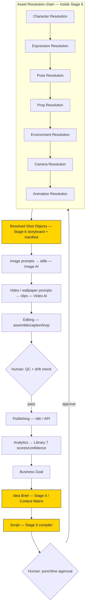

# Production Prompt Framework & Runtime Orchestration

> **Status:** Locked · **Applies to:** every AI, prompt, tool, and automated step that produces a
> C-Cloning asset or video · **Owner role:** Chief Prompt Architect / AI Systems Engineer / Runtime
> Orchestration Designer / Production Pipeline Architect
>
> **This is the master operating system of C-Cloning.** It binds the nine design documents, the locked
> [Stage 4→5→6 pipeline](../../docs/03-locked-roadmap.md), the tool stack, and the automation roadmap
> into **one executable framework**. It defines *how prompts are composed and inherited, how the runtime
> resolves assets, who (which AI) does what, how output is validated, and how a video moves from idea to
> publish.* **Every AI working inside C-Cloning follows this document; every production task is
> executable by following it.**
>
> It is the **capstone/orchestrator** — it does not re-decide any creative or business rule; it
> *sequences and enforces* the rules the other documents already own.

## Inheritance banner — the orchestrator

This document sits **above the design stack and beside the pipeline**. It inherits from everything and
overrides nothing:

- **Creative law (the 9 design docs)** — [Visual Identity Lock](VISUAL_IDENTITY_LOCK.md),
  [Brand Bible](BRAND_BIBLE.md), [Character Bible](CHARACTER_BIBLE.md),
  [Expression Library](EXPRESSION_LIBRARY.md), [Pose Library](POSE_LIBRARY.md),
  [Prop Library](PROP_LIBRARY.md), [Environment Bible](ENVIRONMENT_BIBLE.md),
  [Camera & Cinematography Bible](CAMERA_CINEMATOGRAPHY_BIBLE.md), and
  [Animation Language & Motion System](ANIMATION_LANGUAGE_MOTION_SYSTEM.md). This framework **composes**
  their vocabularies into prompts; it never restates their rules.
- **Pipeline law (the locked stages)** — idea generation ([Stage 4](../../docs/13-stage-4-idea-generator.md)),
  script compilation ([Stage 5](../../docs/14-stage-5-script-compiler.md)), production compilation
  ([Stage 6](../../docs/15-stage-6-production-compiler.md)), the operating rules and Publish Gate
  ([Stage 2](../../docs/12-stage-2-channel-operating-system.md)), and the immutability contract
  ([Locked Roadmap](../../docs/03-locked-roadmap.md)). This framework **orchestrates** these stages; it
  does not change their internal logic.
- **Interfaces already defined** — the prompt contracts ([idea](../../prompts/idea-generation.md) /
  [script](../../prompts/script-compilation.md) / [production](../../prompts/production-compilation.md)),
  the [visual-prompt template](../templates/visual-prompt-template.md), the
  [metadata template](../templates/metadata-template.md), and the tool guides
  ([image generator](../tools/image-generator-usage.md), [Anijam](../tools/anijam-usage.md),
  [ElevenLabs](../tools/elevenlabs-usage.md), [n8n](../tools/n8n-publishing.md)). This framework is the
  layer that *calls* these interfaces in order.

> **Supreme precedence.** The [Locked Roadmap immutability contract](../../docs/03-locked-roadmap.md)
> outranks this document and every other: no prompt, runtime, or AI may re-open a locked decision;
> only **scores/confidence** in [Library 7](../../intelligence/07-virality-intelligence-database.md)
> may change, and only from real analytics.

---

## Table of contents

1. [Purpose](#purpose)
2. [Prompt Philosophy](#prompt-philosophy)
3. [Runtime Architecture](#runtime-architecture)
4. [Prompt Inheritance System](#prompt-inheritance-system)
5. [Prompt Taxonomy](#prompt-taxonomy)
6. [Prompt Composition](#prompt-composition)
7. [Runtime Variables](#runtime-variables)
8. [Asset Resolution](#asset-resolution)
9. [AI Role Definitions](#ai-role-definitions)
10. [Prompt Validation](#prompt-validation)
11. [Production Pipeline](#production-pipeline)
12. [Runtime Contracts](#runtime-contracts)
13. [Quality Assurance](#quality-assurance)
14. [Future Automation](#future-automation)
15. [Repository Integration](#repository-integration)
16. [Change Control](#change-control)

---

## Purpose

A pile of clever prompts is not a production system. The channel ships **10–14 videos per week, for
years, across many AI tools and (eventually) many autonomous agents**
([Stage 2](../../docs/12-stage-2-channel-operating-system.md)). Isolated, hand-written prompts drift,
contradict each other, hallucinate off-catalog assets, and can't be reproduced — the exact failure modes
the whole [structure-over-luck thesis](../../docs/01-project-vision.md) exists to eliminate.

Prompt systems need **architecture** because:

- **Determinism is a product requirement.** Stages 4/5/6 each require that *another agent produces the
  same output from the same input*. That is only possible if prompts are **composed from fixed sources**
  and resolved from a **closed asset catalog** — not improvised.
- **Consistency is the brand.** Every prior document exists to make output identical over time; a prompt
  framework is what actually *delivers* their rules into each generation, every time.
- **Reuse is the cost model.** The sub-30-minute target ([Stage 2](../../docs/12-stage-2-channel-operating-system.md))
  depends on assembling videos from reusable assets via **runtime resolution**, not bespoke prompting.
- **Automation needs contracts.** The [future automated pipeline](../../docs/31-future-runtime-workflow.md)
  and multi-agent workflows can only exist if every step has a **typed interface** and a **validation
  gate** — this document defines them.
- **Hallucination is unacceptable.** An AI that invents an off-model character, an unregistered color, or
  an unnamed shot breaks the brand and monetization. The framework's **closed-vocabulary rule** is the
  guardrail.

> **Rule of thumb:** if a prompt can't state *which document each of its rules comes from* and *which
> catalog IDs it resolves to*, it is not production-ready — it is a draft.

---

## Prompt Philosophy

The principles every prompt and runtime step obeys.

- **Clarity.** A prompt states its role, objective, constraints, assets, and expected output explicitly —
  no implicit intent ([composition](#prompt-composition)).
- **Determinism.** Same inputs → same output. Prompts are **composed**, not free-written; creative choices
  are *resolved* from the catalogs, not invented ([asset resolution](#asset-resolution)).
- **Reusability.** Prompts are built from shared [building blocks](#prompt-composition) and reference
  reusable assets by ID; nothing bespoke that could be a template.
- **Modularity.** Each prompt handles **one** job (one shot, one asset, one metadata field); complex work
  is composed from small prompts ([taxonomy](#prompt-taxonomy)).
- **Inheritance.** Every prompt inherits the full rule stack in a fixed precedence
  ([inheritance system](#prompt-inheritance-system)); it never re-states or contradicts a source.
- **Validation.** Every prompt output passes [validation](#prompt-validation) before it advances; a
  prompt carries its own **self-review** checklist.
- **Future compatibility.** Prompts target *capabilities and contracts*, not a specific model, so a new AI
  model can be swapped in by implementing the same [role contract](#ai-role-definitions).
- **AI collaboration.** The framework assumes **multiple specialized AIs + two human checkpoints**
  ([Future Runtime Workflow](../../docs/31-future-runtime-workflow.md)); prompts are written to be handed
  between agents with typed inputs/outputs.

---

## Runtime Architecture

The complete production runtime, expanded onto the locked pipeline. Each stage is **owned elsewhere**;
this document defines the **sequence, the hand-offs, and the resolution chain inside Stage 6**.



- **Idea → Script → Production package** is the locked [Stage 4](../../docs/13-stage-4-idea-generator.md)
  → [Stage 5](../../docs/14-stage-5-script-compiler.md) → [Stage 6](../../docs/15-stage-6-production-compiler.md)
  spine; this framework calls each via its [prompt contract](#runtime-contracts).
- **The Asset Resolution chain** is the *inside* of Stage 6's storyboard + asset-manifest step, made
  explicit and deterministic ([asset resolution](#asset-resolution)): for each shot, resolve
  character → expression → pose → prop → environment → camera → animation into a
  [Resolved Shot Object](#runtime-variables).
- **Generation** turns each Resolved Shot Object into a **still** (Image AI) then a **clip/wallpaper**
  (Video AI), using the [visual-prompt template](../templates/visual-prompt-template.md) +
  [Animation motion prompts](ANIMATION_LANGUAGE_MOTION_SYSTEM.md#prompt-standards).
- **Editing → Publishing** follow the [editing spec](../A1-first-video/07-editing-spec.md) and
  [n8n publishing](../tools/n8n-publishing.md); **analytics** feed
  [Library 7](../../intelligence/07-virality-intelligence-database.md).
- **Two human checkpoints only** ([Future Runtime Workflow](../../docs/31-future-runtime-workflow.md)):
  punchline approval (after Script) and QC/drift (before Publish).

---

## Prompt Inheritance System

Every prompt **inherits the full rule stack**. Inheritance is *additive specificity* top-down; conflicts
resolve by **domain ownership**, not by list position.

**Inheritance order (each layer adds specificity, none override a parent's domain):**

```
Locked Roadmap / Stage 2  (immutability + operating rules — supreme)
        ↓
Visual Identity Lock       (how everything looks)
        ↓
Brand Bible                (who the channel is: story, tone, voice)
        ↓
Character Bible            (the cast system + profiles)
        ↓
Expression Library         (the face) ── Pose Library (the body) ── Prop Library (objects)
        ↓
Environment Bible          (the world)
        ↓
Camera & Cinematography    (the shot)
        ↓
Animation Language         (the motion)
        ↓
THIS FRAMEWORK             (composition · resolution · validation · orchestration)
```

**Conflict-resolution rules (in order):**

1. **Immutability first.** If a request would change a [locked decision](../../docs/03-locked-roadmap.md)
   (idea parameters, node definitions, frameworks), it is **rejected** — no exceptions.
2. **Domain ownership wins.** The document that *owns* a topic is authoritative on it, regardless of
   position: a **visual** conflict → [Visual Identity Lock](VISUAL_IDENTITY_LOCK.md); **meaning/story/
   voice** → [Brand Bible](BRAND_BIBLE.md); **the face** → [Expression Library](EXPRESSION_LIBRARY.md);
   **the body** → [Pose Library](POSE_LIBRARY.md); **objects** → [Prop Library](PROP_LIBRARY.md); **the
   world** → [Environment Bible](ENVIRONMENT_BIBLE.md); **framing** →
   [Camera Bible](CAMERA_CINEMATOGRAPHY_BIBLE.md); **motion** →
   [Animation Language](ANIMATION_LANGUAGE_MOTION_SYSTEM.md). (Each design doc already declares this in
   its banner; this framework enforces it globally.)
3. **Root wins cross-cutting law.** When two specialists both touch a *cross-cutting* rule (color,
   silhouette, advertiser-safety), the **root** ([Visual Identity Lock](VISUAL_IDENTITY_LOCK.md) for
   look, [Brand Bible](BRAND_BIBLE.md) for tone) is authoritative.
4. **Specific wins detail.** Within a domain, the most specific applicable rule applies (a character's
   per-character override beats the generic default).
5. **Escalate, don't improvise.** If a genuine conflict remains, the runtime **stops and flags** it for a
   human/Change Control — it never resolves a conflict by inventing a compromise.

> A prompt that follows this system can always answer *"which document does this rule come from?"* for
> every line it contains.

---

## Prompt Taxonomy

The canonical prompt categories. Each maps to an [AI role](#ai-role-definitions), a source document, and
a [runtime contract](#runtime-contracts). (Uses the same IN-USE/AVAILABLE convention as the design docs.)

| Prompt | Produces | Primary source doc | Status |
|---|---|---|---|
| **Idea prompt** | A ranked idea brief | [Stage 4](../../docs/13-stage-4-idea-generator.md) / [idea contract](../../prompts/idea-generation.md) | IN USE |
| **Script prompt** | A production-ready script | [Stage 5](../../docs/14-stage-5-script-compiler.md) / [script contract](../../prompts/script-compilation.md) | IN USE |
| **Storyboard prompt** | Shot list + [shot descriptors](CAMERA_CINEMATOGRAPHY_BIBLE.md#shot-descriptor-notation) | [Stage 6](../../docs/15-stage-6-production-compiler.md) / [Camera Bible](CAMERA_CINEMATOGRAPHY_BIBLE.md) | IN USE |
| **Character prompt** | A cast asset | [Character Bible](CHARACTER_BIBLE.md#character-prompt-standards) | IN USE |
| **Expression prompt** | An expression asset | [Expression Library](EXPRESSION_LIBRARY.md#prompt-standards) | IN USE |
| **Pose prompt** | A pose asset | [Pose Library](POSE_LIBRARY.md#prompt-standards) | IN USE |
| **Prop prompt** | A prop asset | [Prop Library](PROP_LIBRARY.md#prompt-standards) | IN USE |
| **Environment prompt** | A location asset | [Environment Bible](ENVIRONMENT_BIBLE.md#prompt-standards) | IN USE |
| **Camera prompt** | A framed shot still | [Camera Bible](CAMERA_CINEMATOGRAPHY_BIBLE.md#prompt-standards) | IN USE |
| **Animation prompt** | A motion clip | [Animation Language](ANIMATION_LANGUAGE_MOTION_SYSTEM.md#prompt-standards) | IN USE |
| **Wallpaper prompt** | A seamless ambient loop | [Animation → Wallpaper](ANIMATION_LANGUAGE_MOTION_SYSTEM.md#wallpaper-motion-system) | AVAILABLE |
| **Thumbnail prompt** | A grid/browse thumbnail | [thumbnail spec](../templates/thumbnail-spec.md) | IN USE |
| **Title prompt** | A title | [metadata template](../templates/metadata-template.md) / [Brand Voice](BRAND_BIBLE.md#brand-voice) | IN USE |
| **Description prompt** | A description | [metadata template](../templates/metadata-template.md) | IN USE |
| **SEO / hashtag prompt** | Tag set + discovery metadata | [metadata template](../templates/metadata-template.md) | IN USE |
| **Publishing prompt** | Upload/schedule payload | [n8n publishing](../tools/n8n-publishing.md) | IN USE |
| **Audit prompt** | A validation/QA scorecard | [Validation](#prompt-validation) / [Publish Gate](../../docs/12-stage-2-channel-operating-system.md) | IN USE |
| **Regression prompt** | A determinism/consistency re-run | [Quality Assurance](#quality-assurance) | AVAILABLE |

**Taxonomy rules:** one job per prompt; every prompt is one of these categories; a new category is added
here **before** use ([Change Control](#change-control)).

---

## Prompt Composition

Every prompt is assembled from the same **building blocks**, in this order. This is the universal prompt
skeleton; the *content* of each block comes (by reference) from the owning documents.

| Block | What it contains | Sourced from |
|---|---|---|
| **`role`** | The [AI role](#ai-role-definitions) and its authority | this framework |
| **`objective`** | The single job (one shot / asset / field) | the [task](#prompt-taxonomy) |
| **`context`** | The beat, script line, and story intent | [Stage 5 script](../../docs/14-stage-5-script-compiler.md) + [Brand Bible](BRAND_BIBLE.md) |
| **`constraints`** | The inherited rules that must hold | the [inheritance stack](#prompt-inheritance-system) (by reference, not restated) |
| **`assets`** | The resolved catalog IDs + descriptors | [asset resolution](#asset-resolution) → [runtime variables](#runtime-variables) |
| **`runtime`** | Duration, fps, aspect, style-lock, seed, loop | [runtime variables](#runtime-variables) |
| **`output`** | The exact deliverable + format/naming | the [runtime contract](#runtime-contracts) |
| **`validation`** | The checks the output must pass | [prompt validation](#prompt-validation) |
| **`self_review`** | A pass/fail checklist the AI runs on its own output before returning | the owning doc's Quality Checklist |

**Composition rules**
- **Reference, don't restate.** `constraints` cite the owning documents (e.g. "obey
  [Color System](VISUAL_IDENTITY_LOCK.md#color-system)"), never copy their text — one source of truth.
- **Assets are IDs, not descriptions.** `assets` are resolved catalog IDs + canonical descriptors
  (never free-text "a smug officer"); this is what makes output reproducible.
- **Always carry the [AI prime directive](ANIMATION_LANGUAGE_MOTION_SYSTEM.md#animation-principles)** in
  generation prompts (snappy pose-to-pose, keep design, no morphing, no extra characters/text).
- **Self-review is mandatory** — every generation prompt ends by running the owning doc's
  [quality checklist](#quality-assurance) and reporting pass/fail.

---

## Runtime Variables

The standardized variables that bind the design-doc descriptors into one machine-readable **Resolved
Shot Object** — the atomic unit the runtime passes to generation. Names are canonical; values are always
catalog IDs or controlled tokens (never free text).

| Variable | Type / value | Source of truth |
|---|---|---|
| `goal` · `behavior` | enum (Reach/Loyalty/…) → behavior | [Stage 4](../../docs/13-stage-4-idea-generator.md) |
| `idea_id` · `script_id` | brief/script reference | [Stage 4](../../docs/13-stage-4-idea-generator.md) / [Stage 5](../../docs/14-stage-5-script-compiler.md) |
| `shot_no` | integer within the video | [Camera Bible](CAMERA_CINEMATOGRAPHY_BIBLE.md#shot-descriptor-notation) |
| `character_id` | `CHAR_[NAME]_v#` | [Character Bible](CHARACTER_BIBLE.md#character-naming-standards) |
| `expression_id` | `CHAR_[NAME]_expr_[name][_l#]` | [Expression Library](EXPRESSION_LIBRARY.md#expression-asset-naming) |
| `pose_id` | `CHAR_[NAME]_pose_[name][_l#]` | [Pose Library](POSE_LIBRARY.md#pose-asset-naming) |
| `prop_id[]` | `PROP_[…]_v#` (list) | [Prop Library](PROP_LIBRARY.md#prop-asset-naming) |
| `environment_id` | `BG_[…]_v#` | [Environment Bible](ENVIRONMENT_BIBLE.md#environmental-assets) |
| `time_of_day` · `weather` | controlled token | [Environment time](ENVIRONMENT_BIBLE.md#time-system) / [weather](ENVIRONMENT_BIBLE.md#weather-system) |
| `camera_descriptor` | `FRAMING.ANGLE.MOVE` | [Camera Bible](CAMERA_CINEMATOGRAPHY_BIBLE.md#shot-descriptor-notation) |
| `motion_descriptor` | [runtime-semantics](ANIMATION_LANGUAGE_MOTION_SYSTEM.md#runtime-semantics) terms | [Animation Language](ANIMATION_LANGUAGE_MOTION_SYSTEM.md) |
| `duration` · `fps` | seconds · 30 | [Animation timing](ANIMATION_LANGUAGE_MOTION_SYSTEM.md#motion-timing) / [Stage 2](../../docs/12-stage-2-channel-operating-system.md) |
| `aspect_ratio` | `9:16` (1080×1920) | [Visual Identity Lock](VISUAL_IDENTITY_LOCK.md#composition-rules) |
| `style_lock` | the locked style prefix + palette | [visual-prompt template](../templates/visual-prompt-template.md) |
| `seed_ref` | continuity seed + fixed screen position | [Visual Identity Lock](VISUAL_IDENTITY_LOCK.md#composition-rules) |
| `loop` | boolean + loop-seam frame match | [Animation loop](ANIMATION_LANGUAGE_MOTION_SYSTEM.md#motion-timing) |
| `on_frame_text` | exact text or `none` (default) | [Visual Identity Lock rendering](VISUAL_IDENTITY_LOCK.md#rendering-rules) |
| `video_id` | `IPPA_[####]_[premise]_[platform]_v#` | [Stage 2](../../docs/12-stage-2-channel-operating-system.md) |

**Resolved Shot Object (example — A1 shot 5):**
```yaml
shot_no: 5
character_id: CHAR_CHIEF_v1
expression_id: CHAR_CHIEF_expr_triumphant_l3
pose_id: CHAR_CHIEF_pose_victory_l3
prop_id: [PROP_stamp_v1, PROP_podium_v1]        # + FX_sparkle_v1
environment_id: BG_parkinglot_v1
time_of_day: afternoon
weather: clear
camera_descriptor: FULL.LOW.PUSHIN
motion_descriptor: "soft anticipation → pose-to-pose snap → long hold (~1.5s); secondary: medal jiggle"
duration: 6
fps: 30
aspect_ratio: "9:16"
style_lock: <visual-prompt-template style prefix>
seed_ref: PROP_chief_scooter_v1 @ lower-right (held)
on_frame_text: none
```

**Variable rules:** every field is a catalog ID or controlled token; a value not found in a catalog is a
[validation](#prompt-validation) failure; new variables are added here before use.

---

## Asset Resolution

How the runtime turns a **script beat** ("CHIEF gloats over PIP with the stamp in the parking lot, low
angle, building push-in") into a fully-specified [Resolved Shot Object](#runtime-variables) — **without
ambiguity and without inventing anything**.

**Resolution order (deterministic, per shot):**

1. **Character** → resolve each named cast member to `character_id` ([Character Bible](CHARACTER_BIBLE.md));
   reject any character not in the roster.
2. **Expression** → map the beat's emotion to the character's tailored `expression_id` + intensity
   ([Expression taxonomy](EXPRESSION_LIBRARY.md#expression-taxonomy)); must be in the character's band.
3. **Pose** → map the beat's action/status to `pose_id` + intensity ([Pose taxonomy](POSE_LIBRARY.md#pose-taxonomy));
   must be [paired-compatible](POSE_LIBRARY.md#pose--expression-pairing) with the expression.
4. **Prop** → resolve objects to `prop_id[]` ([Prop catalog](PROP_LIBRARY.md#character-ownership));
   verify [pose compatibility](PROP_LIBRARY.md#interaction-rules) and locked scale.
5. **Environment** → resolve the location to `environment_id` + `time_of_day`/`weather`
   ([Environment assets](ENVIRONMENT_BIBLE.md#environmental-assets)).
6. **Camera** → assign `camera_descriptor` for the beat ([Camera taxonomy](CAMERA_CINEMATOGRAPHY_BIBLE.md#camera-taxonomy)
   + [sequencing](CAMERA_CINEMATOGRAPHY_BIBLE.md#shot-sequencing)).
7. **Animation** → assign `motion_descriptor` + `duration` + holds/loop
   ([Animation timing](ANIMATION_LANGUAGE_MOTION_SYSTEM.md#motion-timing)).

**Resolution guarantees**
- **Closed catalog only.** Every resolved value must exist in a catalog/vocabulary; the runtime **cannot**
  emit an ID or token that isn't defined ([hallucination prevention](#prompt-validation)).
- **Reuse-first.** Resolution prefers an existing catalog asset over minting a new one
  ([Stage 2](../../docs/12-stage-2-channel-operating-system.md)); "new" is the exception, always
  library-additive.
- **Missing-asset handling:** if a needed asset genuinely doesn't exist → (a) **mint it** through the
  owning document's creation workflow (e.g. a new `PROP_` via the [Prop lifecycle](PROP_LIBRARY.md#production-workflow)),
  tag it *new-but-additive*; or (b) **fall back** to the nearest catalog asset if the beat allows; never
  (c) invent an unnamed/off-model asset.
- **Determinism.** The same script beat resolves to the same Resolved Shot Object every time — the basis
  of [regression testing](#quality-assurance).

---

## AI Role Definitions

The framework assumes a **multi-agent** system: specialized AIs, each with a typed contract, plus the
**two human checkpoints** ([Future Runtime Workflow](../../docs/31-future-runtime-workflow.md)). A new AI
model joins by implementing a role's contract.

| Role | Responsibility | Input → Output | Grounding |
|---|---|---|---|
| **Writer AI** | Compile idea brief → script (compiler discipline, minimal dialogue) | brief → script | [Stage 5](../../docs/14-stage-5-script-compiler.md) · *human punchline approval follows* |
| **Storyboard AI** | Script → shot list + [Resolved Shot Objects](#runtime-variables) | script → storyboard + descriptors | [Stage 6](../../docs/15-stage-6-production-compiler.md) · [Camera Bible](CAMERA_CINEMATOGRAPHY_BIBLE.md) |
| **Prompt AI** | Compose each generation prompt from the [building blocks](#prompt-composition) + resolved assets | shot object → prompt | **this framework** |
| **Image AI** | Generate style-locked stills (cast/props/BG/shot) | prompt → PNG | [image generator](../tools/image-generator-usage.md) |
| **Video AI** | Animate stills into clips/wallpaper loops | still + motion prompt → clip | [Anijam](../tools/anijam-usage.md) / [Animation Language](ANIMATION_LANGUAGE_MOTION_SYSTEM.md) |
| **Voice AI** | Generate fixed-cast VO (dialogue videos only) | script `DLG`/`VO` → audio | [ElevenLabs](../tools/elevenlabs-usage.md) |
| **Review AI** | Run [validation](#prompt-validation) + QA scorecard + drift check; pre-fill the Publish Gate | asset/clip → pass/fail report | [Validation](#prompt-validation) · [Publish Gate](../../docs/12-stage-2-channel-operating-system.md) |
| **Publishing AI** | Attach metadata, schedule/upload, log ID, pull analytics → Library 7 | video + metadata → published + video_id | [n8n publishing](../tools/n8n-publishing.md) |

**Human checkpoints (not automatable in Phase 1):** the **punchline editor** (after Writer AI) and the
**animation QC / drift reviewer** (before Publishing AI) — the two protected roles from the
[daily workflow](../../docs/30-daily-workflow.md).

**Role rules:** each AI stays within its contract; hand-offs are typed ([runtime contracts](#runtime-contracts));
no role re-opens a locked decision or edits another role's domain.

---

## Prompt Validation

Every prompt output passes validation **before it advances**. This is the guardrail that keeps AI on the
catalog and on the brand.

| Validation | Checks | Failure action |
|---|---|---|
| **Schema** | All required [runtime variables](#runtime-variables) present and well-formed | reject → re-resolve |
| **Asset** | Every `*_id` exists in its catalog; every token is in the controlled vocabulary | reject → resolve or mint |
| **Dependency** | Cross-domain compatibility: expression in the character's band; [pose↔expression pairing](POSE_LIBRARY.md#pose--expression-pairing); [pose↔prop compatibility](PROP_LIBRARY.md#interaction-rules); env token [registered](VISUAL_IDENTITY_LOCK.md#color-system); `DISALLOWED` camera/motion not used | reject → fix |
| **Runtime** | Durations/holds within [Stage 2 timing](../../docs/12-stage-2-channel-operating-system.md); 9:16; one-key-action; loop-seam; on-frame-text only where allowed | reject → re-time |
| **Output QA** | The generated asset passes the owning doc's [quality checklist](#quality-assurance) (silhouette, palette, motion, mute-readability) | reject → regenerate |

**Hallucination prevention (the prime guardrail):** the runtime operates on a **closed vocabulary** — it
may only emit catalog IDs and controlled tokens defined in the design docs. Any free-invented character,
color, shot, motion, or object is a **hard failure**, never shipped.

**Missing-asset & fallback rules:** (1) prefer an existing catalog asset (reuse-first); (2) if a new asset
is truly required, **mint it via the owning document's workflow** and tag it new-but-additive; (3) if a
beat can degrade gracefully, **fall back** to the nearest valid catalog asset; (4) if none of these are
possible, **stop and escalate** — never invent silently.

---

## Production Pipeline

The full idea→published flow in repository terminology. This is the [daily workflow](../../docs/30-daily-workflow.md)
converging toward the [future runtime](../../docs/31-future-runtime-workflow.md), expressed as this
framework's orchestration:

1. **Goal** → operator sets the weekly [Business Goal](../../docs/02-objectives.md) mix.
2. **Idea** → Writer/Idea step runs `matrix.select(goal)` → ranked briefs
   ([Stage 4](../../docs/13-stage-4-idea-generator.md), Mode A default + ~1 Mode B per 5).
3. **Script** → Writer AI compiles the brief → script ([Stage 5](../../docs/14-stage-5-script-compiler.md));
   **human punchline approval**.
4. **Resolve** → Storyboard AI produces [Resolved Shot Objects](#runtime-variables) via the
   [asset-resolution chain](#asset-resolution) ([Stage 6](../../docs/15-stage-6-production-compiler.md)
   storyboard + manifest).
5. **Stills** → Prompt AI + Image AI generate style-locked assets/shots
   ([image generator](../tools/image-generator-usage.md)); reuse-first from the library.
6. **Motion** → Video AI animates stills into clips (and wallpaper loops)
   ([Anijam](../tools/anijam-usage.md) + [Animation Language](ANIMATION_LANGUAGE_MOTION_SYSTEM.md)); VO
   only for dialogue videos ([ElevenLabs](../tools/elevenlabs-usage.md)).
7. **Edit** → assemble/caption/loop per the [editing spec](../A1-first-video/07-editing-spec.md) (cuts,
   freeze, loop seam) — the Editing workflow.
8. **Review** → Review AI runs [validation](#prompt-validation) + the QA scorecard; **human QC/drift
   check**; then the 11-point [Publish Gate](../../docs/12-stage-2-channel-operating-system.md) (one
   failure blocks).
9. **Publish** → Publishing AI attaches metadata ([template](../templates/metadata-template.md)),
   schedules/uploads, logs `video_id` ([n8n](../tools/n8n-publishing.md)).
10. **Learn** → analytics update **scores/confidence only** in
    [Library 7](../../intelligence/07-virality-intelligence-database.md) → the Content Matrix re-ranks →
    back to step 2.

**Batch rule** ([daily workflow](../../docs/30-daily-workflow.md)): run each *step* across the whole
weekly batch (assembly line), never one video end-to-end.

---

## Runtime Contracts

The typed interfaces between layers. Each contract has a **producer**, a **consumer**, and a **payload**;
a step may only run when its input contract is satisfied and validated.

| Contract | Producer → Consumer | Payload | Defined by |
|---|---|---|---|
| **Goal → Idea** | operator → Idea step | `business_goal` (+ mode, batch, freshness) | [idea contract](../../prompts/idea-generation.md) |
| **Idea → Script** | Stage 4 → Writer AI | one immutable idea brief | [script contract](../../prompts/script-compilation.md) |
| **Script → Storyboard** | Stage 5 → Storyboard AI | one approved script | [production contract](../../prompts/production-compilation.md) |
| **Storyboard → Prompt** | Storyboard AI → Prompt AI | [Resolved Shot Objects](#runtime-variables) | **this framework** |
| **Prompt → Generation** | Prompt AI → Image/Video AI | composed prompt (blocks + assets + runtime) | [composition](#prompt-composition) |
| **Generation → Review** | Image/Video AI → Review AI | asset/clip + metadata | [validation](#prompt-validation) |
| **Review → Publish** | Review AI + humans → Publishing AI | gate-passed video + publish package | [Publish Gate](../../docs/12-stage-2-channel-operating-system.md) |
| **Publish → Learn** | Publishing AI → Library 7 | `video_id` + analytics | [n8n](../tools/n8n-publishing.md) |

**Contract rules:** payloads are **typed** (IDs/tokens, not prose); a contract is **satisfied only after
validation**; a broken contract **halts and escalates** — no partial or invented hand-offs. Documents
expose their **controlled vocabulary** as the contract surface (a doc → prompt contract), so swapping a
tool or model never changes the interface.

---

## Quality Assurance

The layered QA that keeps output correct and reproducible. Reuses the existing gates; adds the
determinism/regression layer.

- **Validation pipeline** → the automated [prompt validation](#prompt-validation) (schema/asset/
  dependency/runtime/output) on every step.
- **Review pipeline** → **Review AI** self-review checklists + the **two human checkpoints** (punchline,
  QC/drift) from the [daily workflow](../../docs/30-daily-workflow.md).
- **Approval pipeline** → the 11-point [Publish Gate](../../docs/12-stage-2-channel-operating-system.md);
  one failure blocks publishing; the design-doc [quality checklists](VISUAL_IDENTITY_LOCK.md#quality-checklist)
  are the per-asset gates.
- **Regression testing** → because Stages 4/5/6 require **reproducibility**, re-running a locked input
  (a golden brief) must produce the **same** brief/script/Resolved Shot Objects; a diff is a regression to
  investigate (a drifted catalog, a changed prompt).
- **Prompt testing** → **golden fixtures**: **Idea A1** is the canonical end-to-end fixture — its brief,
  script, shot objects, and asset manifest are the expected outputs any change is tested against
  ([A1 package](../A1-first-video/README.md)).

---

## Future Automation

This framework is what makes the [Stage 2 automation roadmap](../../docs/12-stage-2-channel-operating-system.md)
and the [Future Runtime Workflow](../../docs/31-future-runtime-workflow.md) executable.

- **Multi-agent workflows** — the [AI roles](#ai-role-definitions) are agents; the
  [runtime contracts](#runtime-contracts) are their message interfaces; orchestration = running the
  [pipeline](#production-pipeline) with validation gates between agents.
- **Future AI models** — a new/better model is adopted by implementing an existing **role contract**;
  prompts target capabilities + contracts, not a named model, so upgrades are drop-in.
- **Image / video / wallpaper generation** — driven by [Resolved Shot Objects](#runtime-variables) +
  composed prompts; wallpaper via the [Wallpaper Motion System](ANIMATION_LANGUAGE_MOTION_SYSTEM.md#wallpaper-motion-system).
- **Editing & publishing** — increasingly automated per the roadmap (captions, assembly, then metadata/
  schedule via [n8n](../tools/n8n-publishing.md)); the two human checkpoints remain until proven.
- **Repository maintenance** — automation may **only** update Library 7 scores/confidence and add
  library-additive assets; it may **never** edit a [locked decision](../../docs/03-locked-roadmap.md).
  New docs/assets follow the same [inheritance](#prompt-inheritance-system) + [validation](#prompt-validation)
  rules.

> **Master-system guarantee:** any future production task — a new video, a wallpaper, a new character, a
> batch of thumbnails — is executable by following this document: resolve assets → compose prompts →
> validate → generate → review → publish.

---

## Repository Integration

Additive one-line pointers are added in this branch at the highest-traffic entry points; deeper links are
recommendations to avoid over-editing locked docs.

| Document | Relationship | Action |
|---|---|---|
| [`production/design/README.md`](README.md) | Design/identity folder index | Add the framework as the capstone OS + update planned-children note (done) |
| [`docs/00-index.md`](../../docs/00-index.md) | Master doc map | List the framework under Design standards (done) |
| [`production/README.md`](../README.md) | Production folder map | Add to the `design/` tree + a traceability row (done) |
| [`docs/31-future-runtime-workflow.md`](../../docs/31-future-runtime-workflow.md) | The automated pipeline this framework operationalizes | Add a pointer to the framework (done) |
| [`BRAND_BIBLE.md`](BRAND_BIBLE.md) · [`CHARACTER_BIBLE.md`](CHARACTER_BIBLE.md) · [`EXPRESSION_LIBRARY.md`](EXPRESSION_LIBRARY.md) · [`POSE_LIBRARY.md`](POSE_LIBRARY.md) · [`PROP_LIBRARY.md`](PROP_LIBRARY.md) · [`ENVIRONMENT_BIBLE.md`](ENVIRONMENT_BIBLE.md) · [`CAMERA_CINEMATOGRAPHY_BIBLE.md`](CAMERA_CINEMATOGRAPHY_BIBLE.md) · [`ANIMATION_LANGUAGE_MOTION_SYSTEM.md`](ANIMATION_LANGUAGE_MOTION_SYSTEM.md) | Each names a "Prompt Framework" future consumer | Flip those rows to link this doc (done) |

**Anti-duplication (ownership map).** This framework **references and orchestrates**; it owns no creative
or pipeline rule:
- **Idea/score/rank** → [Stage 4](../../docs/13-stage-4-idea-generator.md) / [Library 8](../../intelligence/08-content-matrix.md);
  **script** → [Stage 5](../../docs/14-stage-5-script-compiler.md); **production package** →
  [Stage 6](../../docs/15-stage-6-production-compiler.md); **operating rules + Publish Gate** →
  [Stage 2](../../docs/12-stage-2-channel-operating-system.md).
- **All creative vocabularies + rules** → the nine design docs (referenced by domain).
- **Tool usage** → [tools/](../tools/README.md); **metadata/title formulas** →
  [metadata template](../templates/metadata-template.md); **style prefix** →
  [visual-prompt template](../templates/visual-prompt-template.md).
- **Immutability** → [Locked Roadmap](../../docs/03-locked-roadmap.md).

This framework owns only the **prompt composition model, inheritance precedence & conflict resolution,
runtime variables, cross-domain asset resolution, AI role contracts, prompt validation, runtime
contracts, and end-to-end orchestration**.

---

## Change Control

A **locked** document, governed like the [Locked Roadmap](../../docs/03-locked-roadmap.md) and
[Decision Log](../../docs/21-decision-log.md).

- **Editorial changes** (clarifications, a new AVAILABLE prompt category or runtime variable, examples,
  cross-links) may be made freely; **no version bump**.
- **Substantive changes** (the inheritance/conflict rules, the composition blocks, the resolution order,
  an AI role contract, a validation rule, or a runtime contract) require: (1) a rationale in the
  [Decision Log](../../docs/21-decision-log.md), (2) a pass through the
  [Stage 2 5-Gate test](../../docs/12-stage-2-channel-operating-system.md), and (3) confirmation that no
  [locked decision](../../docs/03-locked-roadmap.md), stage, or design doc is contradicted.
- **New prompt categories, runtime variables, or AI roles** must be added here **before** they are used —
  this is what keeps the runtime deterministic and on-catalog.

> **This is the operating manual for every AI in C-Cloning.** When in doubt: resolve from the catalog,
> compose from the stack, validate before you advance, and never invent what a document already owns.
