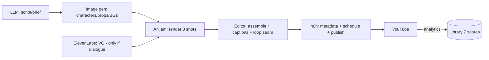

# Tools — Usage & Integration Guides

How to drive the **locked** production tool stack. These guides fill audit finding **F4** (the
"AI render + human QC" step was previously a black box). They document *how to operate the
already-chosen tools* — they do **not** propose new tools or change the stack.

> **Locked stack** (from [Stage 1.5](../../docs/11-stage-1_5-business-decisions.md) and
> [Decision Log D-20](../../docs/21-decision-log.md)):
> **Anijam AI** (animation/consistency/lip-sync) · **ElevenLabs** (voice) ·
> **top-tier image generator** (flat-art backgrounds/props/characters) ·
> **GPT-class LLM** (scripts/ideas) · **n8n / Make.com** (automation & publishing) ·
> AI music + owned/cleared SFX library.

| Guide | Tool | Stage it serves |
|---|---|---|
| [image-generator-usage.md](image-generator-usage.md) | Image generator | Asset generation (Stage 6) |
| [anijam-usage.md](anijam-usage.md) | Anijam AI | Scene render / animation (Stage 6) |
| [elevenlabs-usage.md](elevenlabs-usage.md) | ElevenLabs | Voice (future dialogue videos) |
| [n8n-publishing.md](n8n-publishing.md) | n8n + YouTube API | Publishing / scheduling / metadata |

## Data flow across tools (video build)

## Cost envelope
~$120–250/month at Phase 1 (per [Stage 1.5](../../docs/11-stage-1_5-business-decisions.md)).

## Credentials & safety
- Store all API keys in the automation tool's secret store / environment — **never** commit keys
  to the repo.
- Reference only the specific secrets each step needs.
