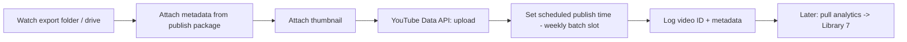

# n8n — Publishing & Scheduling Guide

Automate metadata + scheduling + publishing. n8n (or Make.com) is the locked automation tool
([Stage 1.5](../../docs/11-stage-1_5-business-decisions.md), [D-20](../../docs/21-decision-log.md)):
"chains idea → upload." Publishing/scheduling/metadata is **automation priority #1**
([Stage 2](../../docs/12-stage-2-channel-operating-system.md)).

## Inputs
- Exported video file (from the editor, per the [editing spec](../A1-first-video/07-editing-spec.md)).
- The [publish package](../A1-first-video/08-publish-package.md) (title, description, hashtags, thumbnail).

## Export settings (from the editor)
| Field | Value |
|---|---|
| Container | MP4 (H.264) |
| Resolution / fps | 1080×1920, 30 fps |
| Loudness | ~ -14 LUFS integrated, ≤ -1 dBTP |
| Length | 25–40 s |

## Suggested n8n flow

## Steps
1. **Trigger:** new file in the export folder/drive.
2. **Metadata:** read title/description/hashtags from the [publish package](../A1-first-video/08-publish-package.md)
   (or a per-video metadata file built from the [template](../templates/metadata-template.md)).
3. **Upload** via the YouTube Data API node; set category, playlist, made-for-kids per policy.
4. **Schedule** into the next open slot of the 10–14/week cadence ([daily workflow](../../docs/30-daily-workflow.md)).
5. **Log** the returned video ID for the analytics loop.
6. **Gate:** only run this flow after the [Publish Gate](../A1-first-video/10-production-checklist.md) is 11/11.

## Secrets
- Store the YouTube OAuth credentials and any keys in n8n credentials — **never** in the repo.
- Reference only the specific credential each node needs.

## Analytics feedback (closes the loop)
A later scheduled flow pulls each video's real metrics and updates **scores/confidence only** in
[Library 7](../../intelligence/07-virality-intelligence-database.md) — never the locked frameworks
(per the [Immutability Contract](../../docs/03-locked-roadmap.md)).

## Output
A scheduled/published Short + a logged video ID feeding the self-improving loop.
